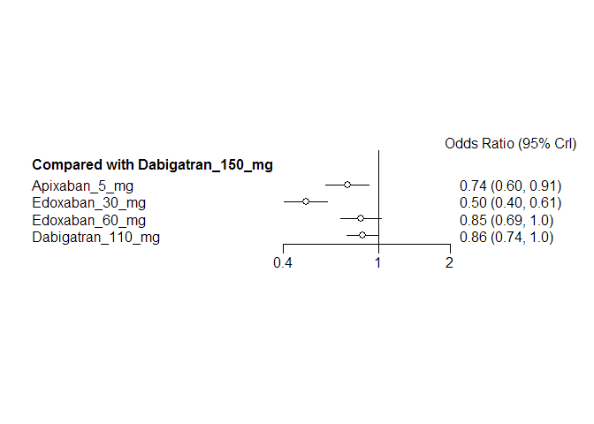
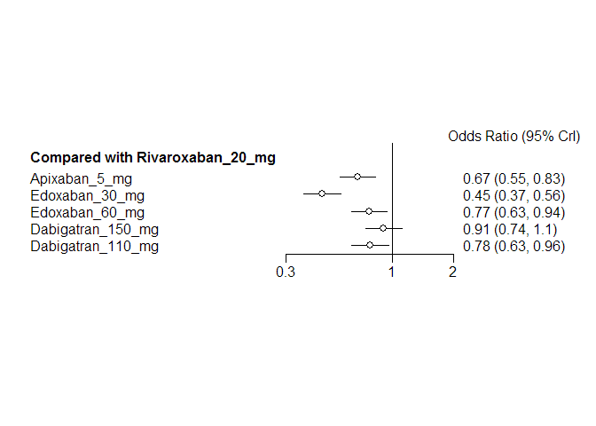
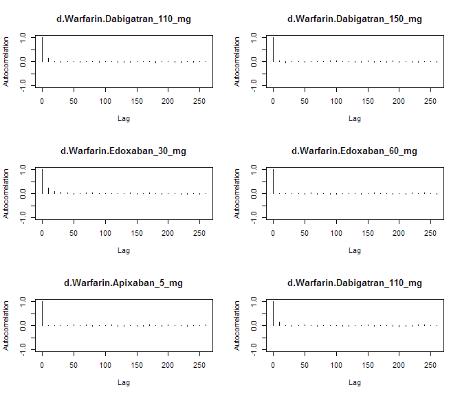
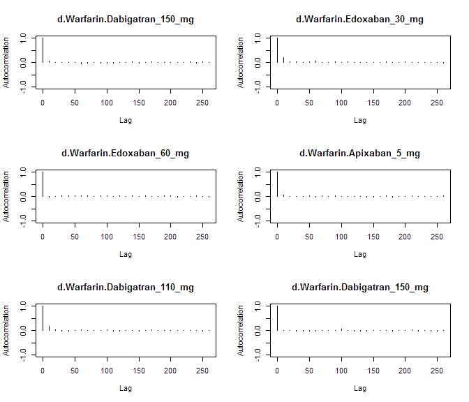
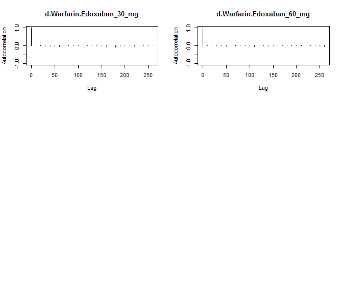
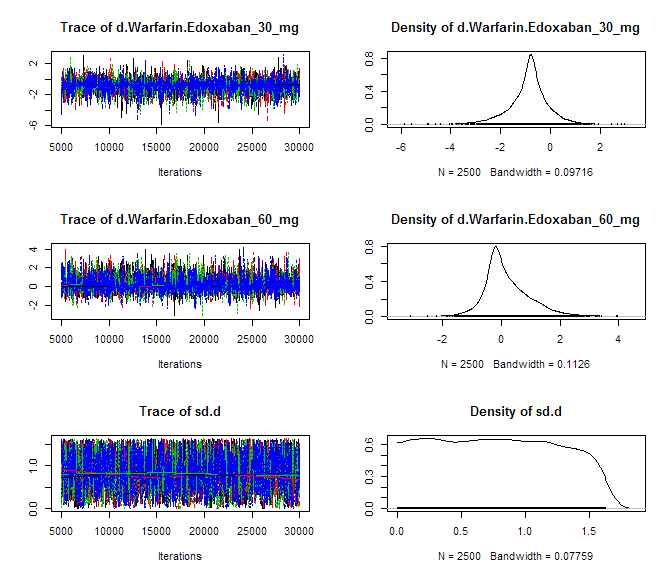
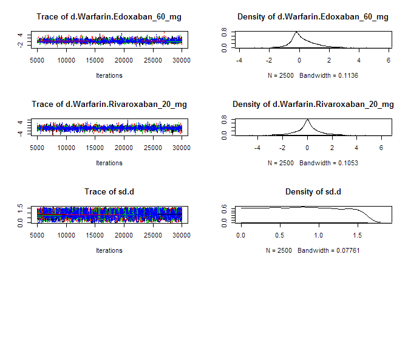
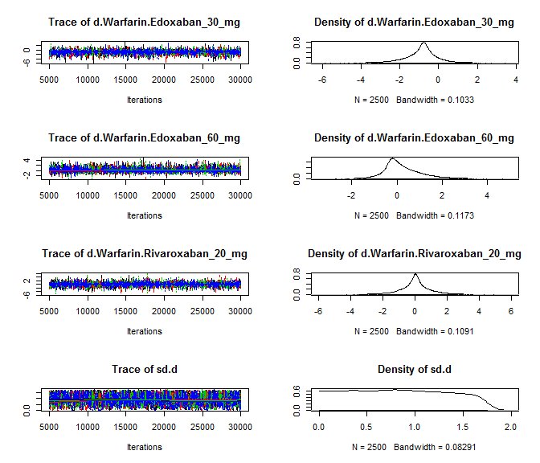

# NOAC network meta-analysis: Bleeding
Benjamin Chan  
`r Sys.time()`  

[Back](README.md) to main page.

Read data.


```r
D <- readSheet("Bleeding")
D <- D[!is.na(label)]
D <- D[,
       `:=` (nWarfarin = as.numeric(nWarfarin),
             yWarfarin = as.numeric(yWarfarin))]
```

Tidy up the data.


```r
D <- tidyData(D)
```

<!-- html table generated in R 3.2.2 by xtable 1.7-4 package -->
<!-- Fri Mar 11 13:36:34 2016 -->
<table border=1>
<tr> <th> study </th> <th> treatment </th> <th> responders </th> <th> sampleSize </th>  </tr>
  <tr> <td> ARISTOTLE </td> <td> Apixaban_5_mg </td> <td align="right"> 327 </td> <td align="right"> 9088 </td> </tr>
  <tr> <td> ARISTOTLE </td> <td> Warfarin </td> <td align="right"> 462 </td> <td align="right"> 9052 </td> </tr>
  <tr> <td> ARISTOTLE-J </td> <td> Apixaban_5_mg </td> <td align="right"> 0 </td> <td align="right"> 74 </td> </tr>
  <tr> <td> ARISTOTLE-J </td> <td> Warfarin </td> <td align="right"> 1 </td> <td align="right"> 74 </td> </tr>
  <tr> <td> ENGAGE AF-TIMI </td> <td> Edoxaban_30_mg </td> <td align="right"> 254 </td> <td align="right"> 7034 </td> </tr>
  <tr> <td> ENGAGE AF-TIMI </td> <td> Edoxaban_60_mg </td> <td align="right"> 418 </td> <td align="right"> 7035 </td> </tr>
  <tr> <td> ENGAGE AF-TIMI </td> <td> Warfarin </td> <td align="right"> 524 </td> <td align="right"> 7036 </td> </tr>
  <tr> <td> PETRO </td> <td> Dabigatran_150_mg </td> <td align="right"> 0 </td> <td align="right"> 100 </td> </tr>
  <tr> <td> PETRO </td> <td> Dabigatran_300_mg </td> <td align="right"> 4 </td> <td align="right"> 161 </td> </tr>
  <tr> <td> PETRO </td> <td> Warfarin </td> <td align="right"> 0 </td> <td align="right"> 70 </td> </tr>
  <tr> <td> RE-LY </td> <td> Dabigatran_110_mg </td> <td align="right"> 322 </td> <td align="right"> 6015 </td> </tr>
  <tr> <td> RE-LY </td> <td> Dabigatran_150_mg </td> <td align="right"> 375 </td> <td align="right"> 6076 </td> </tr>
  <tr> <td> RE-LY </td> <td> Warfarin </td> <td align="right"> 397 </td> <td align="right"> 6022 </td> </tr>
  <tr> <td> ROCKET-AF </td> <td> Rivaroxaban_20_mg </td> <td align="right"> 395 </td> <td align="right"> 7081 </td> </tr>
  <tr> <td> ROCKET-AF </td> <td> Warfarin </td> <td align="right"> 386 </td> <td align="right"> 7090 </td> </tr>
  <tr> <td> Weitz, 2010 </td> <td> Edoxaban_30_mg </td> <td align="right"> 0 </td> <td align="right"> 235 </td> </tr>
  <tr> <td> Weitz, 2010 </td> <td> Edoxaban_60_mg </td> <td align="right"> 1 </td> <td align="right"> 234 </td> </tr>
  <tr> <td> Weitz, 2010 </td> <td> Warfarin </td> <td align="right"> 1 </td> <td align="right"> 250 </td> </tr>
  <tr> <td> Yamashita, 2012 </td> <td> Edoxaban_30_mg </td> <td align="right"> 0 </td> <td align="right"> 131 </td> </tr>
  <tr> <td> Yamashita, 2012 </td> <td> Edoxaban_60_mg </td> <td align="right"> 2 </td> <td align="right"> 131 </td> </tr>
  <tr> <td> Yamashita, 2012 </td> <td> Warfarin </td> <td align="right"> 0 </td> <td align="right"> 129 </td> </tr>
   </table>

Run the model using fixed-effects.


```r
M <- mtc.model(network, type="consistency", linearModel=effect)
plot(M)
```

 

```r
results <- mtc.run(M, n.adapt=nAdapt, n.iter=nIter, thin=thin)
```

# Summary

Direct and indirect odds ratios and 95% confidence bounds are stored in
[mtcBleedingOddsRatios.csv](mtcBleedingOddsRatios.csv).


```r
or <- combineResults(outcomeBleeding=TRUE)
write.csv(or, file="mtcBleedingOddsRatios.csv", row.names=FALSE)
print(xtable(or), type="html", include.rownames=FALSE)
```

<!-- html table generated in R 3.2.2 by xtable 1.7-4 package -->
<!-- Fri Mar 11 13:36:57 2016 -->
<table border=1>
<tr> <th> treatment </th> <th> Apixaban 5 mg </th> <th> Dabigatran 110 mg </th> <th> Dabigatran 150 mg </th> <th> Edoxaban 30 mg </th> <th> Edoxaban 60 mg </th> <th> Rivaroxaban 20 mg </th> <th> Warfarin </th>  </tr>
  <tr> <td> Apixaban 5 mg vs </td> <td>  </td> <td> 0.87 (0.70, 1.07) </td> <td> 0.74 (0.61, 0.91) </td> <td> 1.49 (1.22, 1.84) </td> <td> 0.88 (0.72, 1.07) </td> <td> 0.67 (0.55, 0.82) </td> <td> 0.69 (0.60, 0.80) </td> </tr>
  <tr> <td> Dabigatran 110 mg vs </td> <td> 1.15 (0.93, 1.43) </td> <td>  </td> <td> 0.86 (0.73, 1.00) </td> <td> 1.73 (1.39, 2.13) </td> <td> 1.01 (0.83, 1.23) </td> <td> 0.78 (0.63, 0.95) </td> <td> 0.80 (0.69, 0.93) </td> </tr>
  <tr> <td> Dabigatran 150 mg vs </td> <td> 1.35 (1.10, 1.65) </td> <td> 1.17 (1.00, 1.36) </td> <td>  </td> <td> 2.01 (1.63, 2.47) </td> <td> 1.18 (0.97, 1.43) </td> <td> 0.91 (0.74, 1.11) </td> <td> 0.93 (0.81, 1.08) </td> </tr>
  <tr> <td> Dabigatran 300 mg vs </td> <td> 2758137.38 (9.78, 9369019217906372608.00) </td> <td> 2361636.97 (8.56, 8296019746555851776.00) </td> <td> 2074025.16 (7.28, 6650339332467562496.00) </td> <td> 4056814.71 (14.63, 14707077893376040960.00) </td> <td> 2407321.75 (8.43, 8241436368095220736.00) </td> <td> 1873395.85 (6.70, 6875483530647029760.00) </td> <td> 1900046.00 (6.83, 6400556765895207936.00) </td> </tr>
  <tr> <td> Edoxaban 30 mg vs </td> <td> 0.67 (0.54, 0.82) </td> <td> 0.58 (0.47, 0.72) </td> <td> 0.50 (0.41, 0.61) </td> <td>  </td> <td> 0.59 (0.50, 0.69) </td> <td> 0.45 (0.37, 0.56) </td> <td> 0.46 (0.40, 0.54) </td> </tr>
  <tr> <td> Edoxaban 60 mg vs </td> <td> 1.14 (0.94, 1.39) </td> <td> 0.99 (0.81, 1.21) </td> <td> 0.85 (0.70, 1.03) </td> <td> 1.70 (1.45, 2.00) </td> <td>  </td> <td> 0.77 (0.63, 0.93) </td> <td> 0.79 (0.69, 0.90) </td> </tr>
  <tr> <td> Rivaroxaban 20 mg vs </td> <td> 1.48 (1.21, 1.82) </td> <td> 1.28 (1.05, 1.58) </td> <td> 1.10 (0.90, 1.35) </td> <td> 2.22 (1.80, 2.72) </td> <td> 1.30 (1.07, 1.58) </td> <td>  </td> <td> 1.03 (0.89, 1.19) </td> </tr>
  <tr> <td> Warfarin vs </td> <td> 1.44 (1.25, 1.67) </td> <td> 1.25 (1.08, 1.45) </td> <td> 1.07 (0.93, 1.24) </td> <td> 2.15 (1.85, 2.51) </td> <td> 1.27 (1.11, 1.44) </td> <td> 0.97 (0.84, 1.12) </td> <td>  </td> </tr>
   </table>

# Forest plots, NOAC vs NOAC


```r
noac <- unique(D[treatment != "Warfarin", treatment])
for (i in 1:length(noac)) {
  forest(relative.effect(results, noac[i], noac[1:length(noac) != i]))
}
```

       

# Diagnostics


```r
summary(results)
```

```
## $measure
## [1] "Log Odds Ratio"
## 
## $summaries
## 
## Iterations = 5010:30000
## Thinning interval = 10 
## Number of chains = 4 
## Sample size per chain = 2500 
## 
## 1. Empirical mean and standard deviation for each variable,
##    plus standard error of the mean:
## 
##                                  Mean       SD  Naive SE Time-series SE
## d.Warfarin.Apixaban_5_mg     -0.36698  0.07389 0.0007389      0.0007761
## d.Warfarin.Dabigatran_110_mg -0.22259  0.07732 0.0007732      0.0009283
## d.Warfarin.Dabigatran_150_mg -0.06962  0.07351 0.0007351      0.0007467
## d.Warfarin.Dabigatran_300_mg 16.66754 11.24626 0.1124626      1.3160009
## d.Warfarin.Edoxaban_30_mg    -0.76750  0.07732 0.0007732      0.0009763
## d.Warfarin.Edoxaban_60_mg    -0.23667  0.06722 0.0006722      0.0006993
## d.Warfarin.Rivaroxaban_20_mg  0.02687  0.07316 0.0007316      0.0007460
## 
## 2. Quantiles for each variable:
## 
##                                 2.5%      25%      50%      75%    97.5%
## d.Warfarin.Apixaban_5_mg     -0.5137 -0.41657 -0.36575 -0.31697 -0.22166
## d.Warfarin.Dabigatran_110_mg -0.3719 -0.27533 -0.22184 -0.17126 -0.07281
## d.Warfarin.Dabigatran_150_mg -0.2158 -0.11904 -0.06944 -0.02004  0.07576
## d.Warfarin.Dabigatran_300_mg  1.9214  7.73378 14.45739 22.92745 43.30292
## d.Warfarin.Edoxaban_30_mg    -0.9187 -0.81899 -0.76758 -0.71661 -0.61373
## d.Warfarin.Edoxaban_60_mg    -0.3668 -0.28316 -0.23554 -0.19064 -0.10606
## d.Warfarin.Rivaroxaban_20_mg -0.1157 -0.02242  0.02682  0.07638  0.17054
## 
## 
## $DIC
##     Dbar       pD      DIC 
## 20.58476 14.28820 34.87296 
## 
## attr(,"class")
## [1] "summary.mtc.result"
```

Sampler diagnostics.


```r
gelman.plot(results)
```

 

```r
gelman.diag(results)
```

```
## Potential scale reduction factors:
## 
##                              Point est. Upper C.I.
## d.Warfarin.Apixaban_5_mg           1.00       1.00
## d.Warfarin.Dabigatran_110_mg       1.00       1.00
## d.Warfarin.Dabigatran_150_mg       1.00       1.00
## d.Warfarin.Dabigatran_300_mg       1.04       1.09
## d.Warfarin.Edoxaban_30_mg          1.00       1.00
## d.Warfarin.Edoxaban_60_mg          1.00       1.00
## d.Warfarin.Rivaroxaban_20_mg       1.00       1.00
## 
## Multivariate psrf
## 
## 1.02
```


```r
plot(results)
```

  


```r
autocorr.plot(results$samples)
```

    

Assess the degree of heterogeneity and inconsistency.


```r
anohe <- mtc.anohe(network, n.adapt=nAdapt, n.iter=nIter, thin=thin)
```


```r
summary(anohe)
```

```
## Analysis of heterogeneity
## =========================
## 
## Per-comparison I-squared:
## -------------------------
## 
##                   t1                t2   i2.pair  i2.cons incons.p
## 1      Apixaban_5_mg          Warfarin 98.805564 76.02447       NA
## 2  Dabigatran_110_mg Dabigatran_150_mg        NA       NA       NA
## 3  Dabigatran_110_mg          Warfarin        NA       NA       NA
## 4  Dabigatran_150_mg Dabigatran_300_mg        NA       NA       NA
## 5  Dabigatran_150_mg          Warfarin  5.543001  0.00000       NA
## 6  Dabigatran_300_mg          Warfarin        NA       NA       NA
## 7     Edoxaban_30_mg    Edoxaban_60_mg 94.851878 86.66596       NA
## 8     Edoxaban_30_mg          Warfarin 12.056482  0.00000       NA
## 9     Edoxaban_60_mg          Warfarin 31.167865 87.91402       NA
## 10 Rivaroxaban_20_mg          Warfarin        NA       NA       NA
## 
## Global I-squared:
## -------------------------
## 
##    i2.pair  i2.cons
## 1 86.80871 54.98002
```

```r
plot(anohe)
```

```
## Analysis of heterogeneity -- convergence plots
## Unrelated Study Effects (USE) model:
```

    

```
## Unrelated Mean Effects (UME) model:
```

    

```
## Consistency model:
```

  
