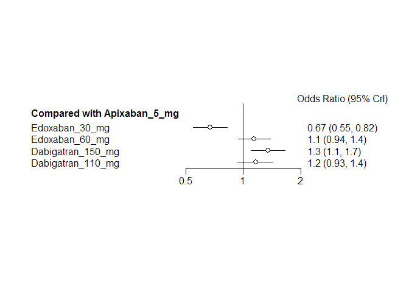
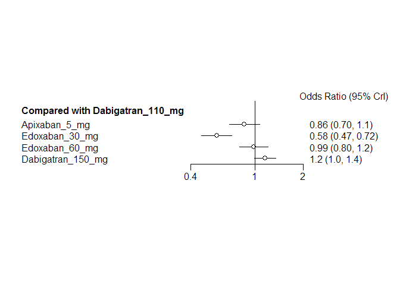

# NOAC network meta-analysis: Bleeding
Benjamin Chan  
`r Sys.time()`  

[Back](README.md) to main page.

Read data.


```r
D <- readSheet("Bleeding")
D <- D[!is.na(label)]
D <- D[,
       `:=` (nWarfarin = as.numeric(nWarfarin),
             yWarfarin = as.numeric(yWarfarin))]
```

Tidy up the data (do not show the code).

<!-- html table generated in R 3.2.2 by xtable 1.7-4 package -->
<!-- Fri Feb 05 15:24:19 2016 -->
<table border=1>
<tr> <th> study </th> <th> treatment </th> <th> responders </th> <th> sampleSize </th>  </tr>
  <tr> <td> ARISTOTLE </td> <td> Apixaban_5_mg </td> <td align="right"> 327 </td> <td align="right"> 9088 </td> </tr>
  <tr> <td> ARISTOTLE </td> <td> Warfarin </td> <td align="right"> 462 </td> <td align="right"> 9052 </td> </tr>
  <tr> <td> ARISTOTLE-J </td> <td> Apixaban_5_mg </td> <td align="right"> 0 </td> <td align="right"> 74 </td> </tr>
  <tr> <td> ARISTOTLE-J </td> <td> Warfarin </td> <td align="right"> 1 </td> <td align="right"> 74 </td> </tr>
  <tr> <td> ENGAGE AF-TIMI </td> <td> Edoxaban_30_mg </td> <td align="right"> 254 </td> <td align="right"> 7034 </td> </tr>
  <tr> <td> ENGAGE AF-TIMI </td> <td> Edoxaban_60_mg </td> <td align="right"> 418 </td> <td align="right"> 7035 </td> </tr>
  <tr> <td> ENGAGE AF-TIMI </td> <td> Warfarin </td> <td align="right"> 524 </td> <td align="right"> 7036 </td> </tr>
  <tr> <td> J-ROCKET </td> <td> Rivaroxaban_15_mg </td> <td align="right">  </td> <td align="right"> 639 </td> </tr>
  <tr> <td> J-ROCKET </td> <td> Warfarin </td> <td align="right">  </td> <td align="right"> 639 </td> </tr>
  <tr> <td> PETRO </td> <td> Dabigatran_300_mg </td> <td align="right"> 4 </td> <td align="right"> 161 </td> </tr>
  <tr> <td> PETRO </td> <td> Warfarin </td> <td align="right"> 0 </td> <td align="right"> 70 </td> </tr>
  <tr> <td> RE-LY </td> <td> Dabigatran_110_mg </td> <td align="right"> 322 </td> <td align="right"> 6015 </td> </tr>
  <tr> <td> RE-LY </td> <td> Dabigatran_150_mg </td> <td align="right"> 375 </td> <td align="right"> 6076 </td> </tr>
  <tr> <td> RE-LY </td> <td> Warfarin </td> <td align="right"> 397 </td> <td align="right"> 6022 </td> </tr>
  <tr> <td> ROCKET-AF </td> <td> Rivaroxaban_20_mg </td> <td align="right"> 395 </td> <td align="right"> 7081 </td> </tr>
  <tr> <td> ROCKET-AF </td> <td> Warfarin </td> <td align="right"> 386 </td> <td align="right"> 7090 </td> </tr>
  <tr> <td> Yamashita, 2012 </td> <td> Edoxaban_30_mg </td> <td align="right"> 0 </td> <td align="right"> 131 </td> </tr>
  <tr> <td> Yamashita, 2012 </td> <td> Edoxaban_60_mg </td> <td align="right"> 2 </td> <td align="right"> 131 </td> </tr>
  <tr> <td> Yamashita, 2012 </td> <td> Warfarin </td> <td align="right"> 0 </td> <td align="right"> 129 </td> </tr>
   </table>

Run the model using fixed-effects.


```r
M <- mtc.model(network, type="consistency", linearModel=effect)
plot(M)
```

 

```r
results <- mtc.run(M, n.adapt=nAdapt, n.iter=nIter, thin=thin)
```

# Summary

Direct and indirect odds ratios and 95% confidence bounds are stored in
[mtcBleedingOddsRatios.csv](mtcBleedingOddsRatios.csv).


```r
or <- combineResults(outcomeBleeding=TRUE)
write.csv(or, file="mtcBleedingOddsRatios.csv", row.names=FALSE)
print(xtable(or), type="html", include.rownames=FALSE)
```

<!-- html table generated in R 3.2.2 by xtable 1.7-4 package -->
<!-- Fri Feb 05 15:24:38 2016 -->
<table border=1>
<tr> <th> treatment </th> <th> Apixaban 5 mg </th> <th> Dabigatran 110 mg </th> <th> Dabigatran 150 mg </th> <th> Dabigatran 300 mg </th> <th> Edoxaban 30 mg </th> <th> Edoxaban 60 mg </th> <th> Rivaroxaban 20 mg </th> <th> Warfarin </th>  </tr>
  <tr> <td> Apixaban 5 mg vs </td> <td>  </td> <td> 0.87 (0.70, 1.07) </td> <td> 0.74 (0.60, 0.91) </td> <td> 0.00 (0.00, 0.17) </td> <td> 1.49 (1.21, 1.84) </td> <td> 0.88 (0.72, 1.07) </td> <td> 0.67 (0.55, 0.83) </td> <td> 0.69 (0.60, 0.80) </td> </tr>
  <tr> <td> Dabigatran 110 mg vs </td> <td> 1.16 (0.94, 1.42) </td> <td>  </td> <td> 0.86 (0.74, 1.00) </td> <td> 0.00 (0.00, 0.19) </td> <td> 1.72 (1.39, 2.14) </td> <td> 1.02 (0.83, 1.24) </td> <td> 0.78 (0.64, 0.96) </td> <td> 0.80 (0.69, 0.93) </td> </tr>
  <tr> <td> Dabigatran 150 mg vs </td> <td> 1.34 (1.10, 1.66) </td> <td> 1.16 (1.00, 1.35) </td> <td>  </td> <td> 0.00 (0.00, 0.23) </td> <td> 2.00 (1.63, 2.48) </td> <td> 1.18 (0.97, 1.44) </td> <td> 0.91 (0.74, 1.11) </td> <td> 0.93 (0.81, 1.08) </td> </tr>
  <tr> <td> Dabigatran 300 mg vs </td> <td> 31946773.96 (5.98, 1620519202647950630186802.00) </td> <td> 27048270.24 (5.26, 1508087517121492304326606.00) </td> <td> 23451182.55 (4.44, 1250937081720965674664402.00) </td> <td>  </td> <td> 47306554.11 (8.81, 2615893004299463653602862.00) </td> <td> 28251231.92 (5.11, 1415386910308593320320606.00) </td> <td> 21289677.77 (3.91, 1129674561282455506004468.00) </td> <td> 21701260.45 (4.09, 1142127572624181089526822.00) </td> </tr>
  <tr> <td> Edoxaban 30 mg vs </td> <td> 0.67 (0.54, 0.83) </td> <td> 0.58 (0.47, 0.72) </td> <td> 0.50 (0.40, 0.61) </td> <td> 0.00 (0.00, 0.11) </td> <td>  </td> <td> 0.59 (0.50, 0.69) </td> <td> 0.45 (0.37, 0.56) </td> <td> 0.47 (0.40, 0.54) </td> </tr>
  <tr> <td> Edoxaban 60 mg vs </td> <td> 1.14 (0.93, 1.39) </td> <td> 0.98 (0.81, 1.21) </td> <td> 0.85 (0.70, 1.03) </td> <td> 0.00 (0.00, 0.20) </td> <td> 1.69 (1.45, 1.99) </td> <td>  </td> <td> 0.77 (0.63, 0.94) </td> <td> 0.79 (0.69, 0.90) </td> </tr>
  <tr> <td> Rivaroxaban 20 mg vs </td> <td> 1.48 (1.20, 1.82) </td> <td> 1.28 (1.04, 1.57) </td> <td> 1.10 (0.90, 1.35) </td> <td> 0.00 (0.00, 0.26) </td> <td> 2.20 (1.80, 2.73) </td> <td> 1.30 (1.07, 1.58) </td> <td>  </td> <td> 1.03 (0.89, 1.19) </td> </tr>
  <tr> <td> Warfarin vs </td> <td> 1.44 (1.25, 1.67) </td> <td> 1.25 (1.07, 1.45) </td> <td> 1.07 (0.93, 1.24) </td> <td> 0.00 (0.00, 0.24) </td> <td> 2.15 (1.85, 2.51) </td> <td> 1.27 (1.11, 1.45) </td> <td> 0.97 (0.84, 1.13) </td> <td>  </td> </tr>
   </table>

# Forest plots, NOAC vs NOAC


```r
noac <- unique(D[treatment != "Warfarin", treatment])
for (i in 1:length(noac)) {
  forest(relative.effect(results, noac[i], noac[1:length(noac) != i]))
}
```

       

# Diagnostics


```r
summary(results)
```

```
## $measure
## [1] "Log Odds Ratio"
## 
## $summaries
## 
## Iterations = 5010:30000
## Thinning interval = 10 
## Number of chains = 4 
## Sample size per chain = 2500 
## 
## 1. Empirical mean and standard deviation for each variable,
##    plus standard error of the mean:
## 
##                                  Mean       SD  Naive SE Time-series SE
## d.Warfarin.Apixaban_5_mg     -0.36771  0.07439 0.0007439      0.0007498
## d.Warfarin.Dabigatran_110_mg -0.22225  0.07732 0.0007732      0.0009350
## d.Warfarin.Dabigatran_150_mg -0.07041  0.07397 0.0007397      0.0007524
## d.Warfarin.Dabigatran_300_mg 19.99293 14.52090 0.1452090      0.1434901
## d.Warfarin.Edoxaban_30_mg    -0.76545  0.07763 0.0007763      0.0010134
## d.Warfarin.Edoxaban_60_mg    -0.23682  0.06843 0.0006843      0.0006843
## d.Warfarin.Rivaroxaban_20_mg  0.02566  0.07347 0.0007347      0.0007320
## 
## 2. Quantiles for each variable:
## 
##                                 2.5%      25%      50%      75%    97.5%
## d.Warfarin.Apixaban_5_mg     -0.5140 -0.41740 -0.36726 -0.31781 -0.22171
## d.Warfarin.Dabigatran_110_mg -0.3746 -0.27355 -0.22210 -0.16949 -0.07159
## d.Warfarin.Dabigatran_150_mg -0.2165 -0.12030 -0.07029 -0.01974  0.07350
## d.Warfarin.Dabigatran_300_mg  1.4084  8.74328 16.89288 28.28858 55.39494
## d.Warfarin.Edoxaban_30_mg    -0.9183 -0.81795 -0.76418 -0.71340 -0.61752
## d.Warfarin.Edoxaban_60_mg    -0.3727 -0.28342 -0.23715 -0.19031 -0.10476
## d.Warfarin.Rivaroxaban_20_mg -0.1182 -0.02345  0.02607  0.07471  0.17047
## 
## 
## $DIC
##     Dbar       pD      DIC 
## 18.52735 13.20062 31.72797 
## 
## attr(,"class")
## [1] "summary.mtc.result"
```

Sampler diagnostics.


```r
gelman.plot(results)
```

 

```r
gelman.diag(results)
```

```
## Potential scale reduction factors:
## 
##                              Point est. Upper C.I.
## d.Warfarin.Apixaban_5_mg              1          1
## d.Warfarin.Dabigatran_110_mg          1          1
## d.Warfarin.Dabigatran_150_mg          1          1
## d.Warfarin.Dabigatran_300_mg          1          1
## d.Warfarin.Edoxaban_30_mg             1          1
## d.Warfarin.Edoxaban_60_mg             1          1
## d.Warfarin.Rivaroxaban_20_mg          1          1
## 
## Multivariate psrf
## 
## 1
```


```r
plot(results)
```

  


```r
autocorr.plot(results$samples)
```

    

Assess the degree of heterogeneity and inconsistency.


```r
anohe <- mtc.anohe(network, n.adapt=nAdapt, n.iter=nIter, thin=thin)
```


```r
summary(anohe)
```

```
## Analysis of heterogeneity
## =========================
## 
## Per-comparison I-squared:
## -------------------------
## 
##                  t1                t2  i2.pair  i2.cons incons.p
## 1     Apixaban_5_mg          Warfarin 99.92521 84.45483       NA
## 2 Dabigatran_110_mg Dabigatran_150_mg       NA       NA       NA
## 3 Dabigatran_110_mg          Warfarin       NA       NA       NA
## 4 Dabigatran_150_mg          Warfarin       NA       NA       NA
## 5 Dabigatran_300_mg          Warfarin       NA       NA       NA
## 6    Edoxaban_30_mg    Edoxaban_60_mg 99.72513 89.16789       NA
## 7    Edoxaban_30_mg          Warfarin 98.25657  0.00000       NA
## 8    Edoxaban_60_mg          Warfarin 99.54353 96.06568       NA
## 9 Rivaroxaban_20_mg          Warfarin       NA       NA       NA
## 
## Global I-squared:
## -------------------------
## 
##    i2.pair  i2.cons
## 1 99.45745 71.27949
```

```r
plot(anohe)
```

```
## Analysis of heterogeneity -- convergence plots
## Unrelated Study Effects (USE) model:
```

    

```
## Unrelated Mean Effects (UME) model:
```

    

```
## Consistency model:
```

  
