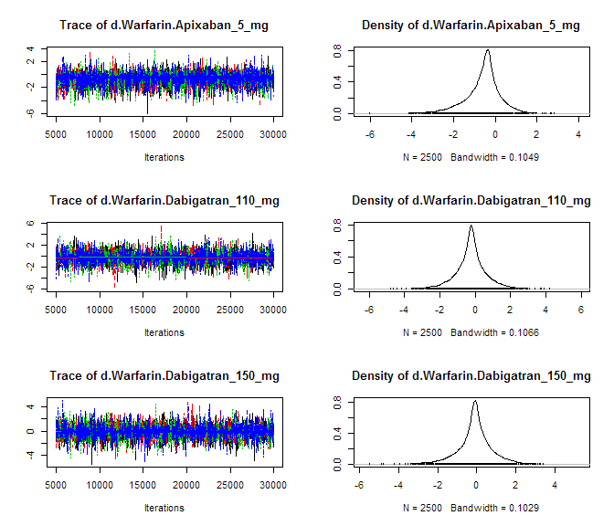

# NOAC network meta-analysis: Bleeding
Benjamin Chan  
`r Sys.time()`  

[Back](README.md) to main page.

Clean up the data (do not show the code).

<!-- html table generated in R 3.2.2 by xtable 1.7-4 package -->
<!-- Thu Feb 04 14:54:15 2016 -->
<table border=1>
<tr> <th> study </th> <th> treatment </th> <th> responders </th> <th> sampleSize </th>  </tr>
  <tr> <td> RE-LY </td> <td> Dabigatran_110_mg </td> <td align="right"> 322 </td> <td align="right"> 6015 </td> </tr>
  <tr> <td> RE-LY </td> <td> Dabigatran_150_mg </td> <td align="right"> 375 </td> <td align="right"> 6076 </td> </tr>
  <tr> <td> RE-LY </td> <td> Warfarin </td> <td align="right"> 397 </td> <td align="right"> 6022 </td> </tr>
  <tr> <td> ARISTOTLE </td> <td> Apixaban_5_mg </td> <td align="right"> 148 </td> <td align="right"> 9120 </td> </tr>
  <tr> <td> ARISTOTLE </td> <td> Warfarin </td> <td align="right"> 256 </td> <td align="right"> 9081 </td> </tr>
  <tr> <td> ROCKET-AF </td> <td> Rivaroxaban_20_mg </td> <td align="right"> 395 </td> <td align="right"> 7131 </td> </tr>
  <tr> <td> ROCKET-AF </td> <td> Warfarin </td> <td align="right"> 386 </td> <td align="right"> 7133 </td> </tr>
  <tr> <td> ENGAGE AF-TIMI </td> <td> Edoxaban_30_mg </td> <td align="right"> 418 </td> <td align="right"> 7034 </td> </tr>
  <tr> <td> ENGAGE AF-TIMI </td> <td> Edoxaban_60_mg </td> <td align="right"> 254 </td> <td align="right"> 7035 </td> </tr>
  <tr> <td> ENGAGE AF-TIMI </td> <td> Warfarin </td> <td align="right"> 524 </td> <td align="right"> 7036 </td> </tr>
   </table>

`Run the model using fixed-effects.


```r
M <- mtc.model(network, type="consistency", linearModel=effect)
plot(M)
```

 

```r
results <- mtc.run(M, n.adapt=nAdapt, n.iter=nIter, thin=thin)
```

# Summary

Direct and indirect odds ratios and 95% confidence bounds are stored in
[mtcBleedingOddsRatios.csv](mtcBleedingOddsRatios.csv).


```r
or <- combineResults(outcomeBleeding=TRUE)
write.csv(or, file="mtcBleedingOddsRatios.csv", row.names=FALSE)
print(xtable(or), type="html", include.rownames=FALSE)
```

<!-- html table generated in R 3.2.2 by xtable 1.7-4 package -->
<!-- Thu Feb 04 14:54:29 2016 -->
<table border=1>
<tr> <th> treatment </th> <th> Apixaban 5 mg </th> <th> Dabigatran 110 mg </th> <th> Dabigatran 150 mg </th> <th> Edoxaban 30 mg </th> <th> Edoxaban 60 mg </th> <th> Rivaroxaban 20 mg </th> <th> Warfarin </th>  </tr>
  <tr> <td> Apixaban 5 mg vs </td> <td>  </td> <td> 0.71 (0.55, 0.91) </td> <td> 0.61 (0.47, 0.78) </td> <td> 0.72 (0.57, 0.92) </td> <td> 1.22 (0.94, 1.59) </td> <td> 0.55 (0.43, 0.71) </td> <td> 0.57 (0.46, 0.70) </td> </tr>
  <tr> <td> Dabigatran 110 mg vs </td> <td> 1.41 (1.09, 1.82) </td> <td>  </td> <td> 0.86 (0.74, 1.00) </td> <td> 1.02 (0.84, 1.25) </td> <td> 1.72 (1.40, 2.14) </td> <td> 0.78 (0.63, 0.97) </td> <td> 0.80 (0.69, 0.93) </td> </tr>
  <tr> <td> Dabigatran 150 mg vs </td> <td> 1.64 (1.28, 2.12) </td> <td> 1.16 (1.00, 1.36) </td> <td>  </td> <td> 1.19 (0.97, 1.44) </td> <td> 2.00 (1.62, 2.48) </td> <td> 0.91 (0.74, 1.11) </td> <td> 0.93 (0.81, 1.08) </td> </tr>
  <tr> <td> Edoxaban 30 mg vs </td> <td> 1.38 (1.08, 1.77) </td> <td> 0.98 (0.80, 1.20) </td> <td> 0.84 (0.69, 1.03) </td> <td>  </td> <td> 1.69 (1.45, 1.98) </td> <td> 0.77 (0.63, 0.93) </td> <td> 0.79 (0.69, 0.89) </td> </tr>
  <tr> <td> Edoxaban 60 mg vs </td> <td> 0.82 (0.63, 1.06) </td> <td> 0.58 (0.47, 0.72) </td> <td> 0.50 (0.40, 0.62) </td> <td> 0.59 (0.50, 0.69) </td> <td>  </td> <td> 0.45 (0.37, 0.56) </td> <td> 0.47 (0.40, 0.54) </td> </tr>
  <tr> <td> Rivaroxaban 20 mg vs </td> <td> 1.80 (1.40, 2.32) </td> <td> 1.28 (1.03, 1.58) </td> <td> 1.10 (0.90, 1.35) </td> <td> 1.31 (1.07, 1.59) </td> <td> 2.21 (1.79, 2.73) </td> <td>  </td> <td> 1.03 (0.89, 1.19) </td> </tr>
  <tr> <td> Warfarin vs </td> <td> 1.76 (1.44, 2.16) </td> <td> 1.25 (1.07, 1.45) </td> <td> 1.07 (0.93, 1.24) </td> <td> 1.27 (1.12, 1.45) </td> <td> 2.15 (1.85, 2.51) </td> <td> 0.97 (0.84, 1.13) </td> <td>  </td> </tr>
   </table>

# Diagnostics


```r
summary(results)
```

```
## $measure
## [1] "Log Odds Ratio"
## 
## $summaries
## 
## Iterations = 5010:30000
## Thinning interval = 10 
## Number of chains = 4 
## Sample size per chain = 2500 
## 
## 1. Empirical mean and standard deviation for each variable,
##    plus standard error of the mean:
## 
##                                  Mean      SD  Naive SE Time-series SE
## d.Warfarin.Apixaban_5_mg     -0.56623 0.10453 0.0010453      0.0011075
## d.Warfarin.Dabigatran_110_mg -0.22181 0.07723 0.0007723      0.0009299
## d.Warfarin.Dabigatran_150_mg -0.07056 0.07405 0.0007405      0.0007639
## d.Warfarin.Edoxaban_30_mg    -0.24151 0.06709 0.0006709      0.0007226
## d.Warfarin.Edoxaban_60_mg    -0.76599 0.07829 0.0007829      0.0007828
## d.Warfarin.Rivaroxaban_20_mg  0.02550 0.07431 0.0007431      0.0007489
## 
## 2. Quantiles for each variable:
## 
##                                 2.5%      25%      50%      75%    97.5%
## d.Warfarin.Apixaban_5_mg     -0.7723 -0.63623 -0.56786 -0.49525 -0.36300
## d.Warfarin.Dabigatran_110_mg -0.3726 -0.27363 -0.22200 -0.16976 -0.06904
## d.Warfarin.Dabigatran_150_mg -0.2154 -0.11993 -0.07074 -0.02172  0.07549
## d.Warfarin.Edoxaban_30_mg    -0.3736 -0.28736 -0.24057 -0.19637 -0.11167
## d.Warfarin.Edoxaban_60_mg    -0.9206 -0.81879 -0.76553 -0.71268 -0.61403
## d.Warfarin.Rivaroxaban_20_mg -0.1219 -0.02355  0.02583  0.07499  0.17241
## 
## 
## $DIC
##      Dbar        pD       DIC 
##  9.984811  9.984214 19.969025 
## 
## attr(,"class")
## [1] "summary.mtc.result"
```

Sampler diagnostics.


```r
gelman.plot(results)
```

 

```r
gelman.diag(results)
```

```
## Potential scale reduction factors:
## 
##                              Point est. Upper C.I.
## d.Warfarin.Apixaban_5_mg              1          1
## d.Warfarin.Dabigatran_110_mg          1          1
## d.Warfarin.Dabigatran_150_mg          1          1
## d.Warfarin.Edoxaban_30_mg             1          1
## d.Warfarin.Edoxaban_60_mg             1          1
## d.Warfarin.Rivaroxaban_20_mg          1          1
## 
## Multivariate psrf
## 
## 1
```


```r
plot(results)
```

  


```r
autocorr.plot(results$samples)
```

    

Assess the degree of heterogeneity and inconsistency.


```r
anohe <- mtc.anohe(network, n.adapt=nAdapt, n.iter=nIter, thin=thin)
```


```r
summary(anohe)
```

```
## Analysis of heterogeneity
## =========================
## 
## Per-comparison I-squared:
## -------------------------
## 
##                  t1                t2 i2.pair i2.cons incons.p
## 1     Apixaban_5_mg          Warfarin      NA      NA       NA
## 2 Dabigatran_110_mg Dabigatran_150_mg      NA      NA       NA
## 3 Dabigatran_110_mg          Warfarin      NA      NA       NA
## 4 Dabigatran_150_mg          Warfarin      NA      NA       NA
## 5    Edoxaban_30_mg    Edoxaban_60_mg      NA      NA       NA
## 6    Edoxaban_30_mg          Warfarin      NA      NA       NA
## 7    Edoxaban_60_mg          Warfarin      NA      NA       NA
## 8 Rivaroxaban_20_mg          Warfarin      NA      NA       NA
## 
## Global I-squared:
## -------------------------
## 
##   i2.pair i2.cons
## 1       0       0
```

```r
plot(anohe)
```

```
## Analysis of heterogeneity -- convergence plots
## Unrelated Study Effects (USE) model:
```

  

```
## Unrelated Mean Effects (UME) model:
```

   

```
## Consistency model:
```

  
