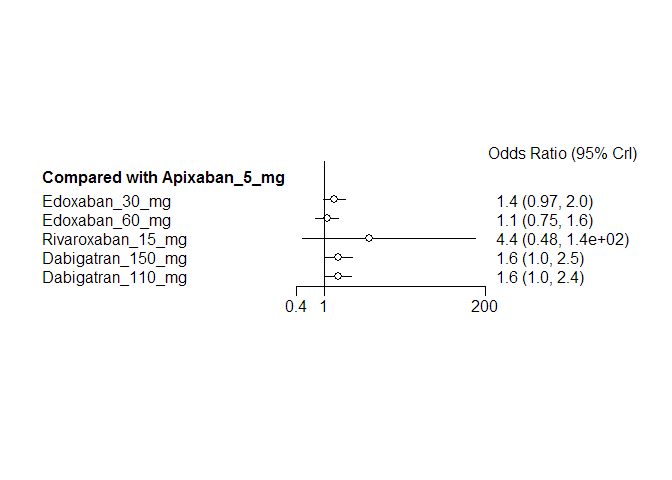
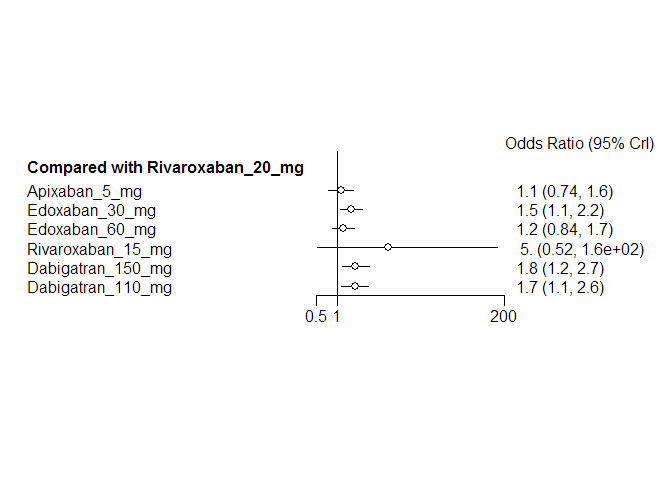
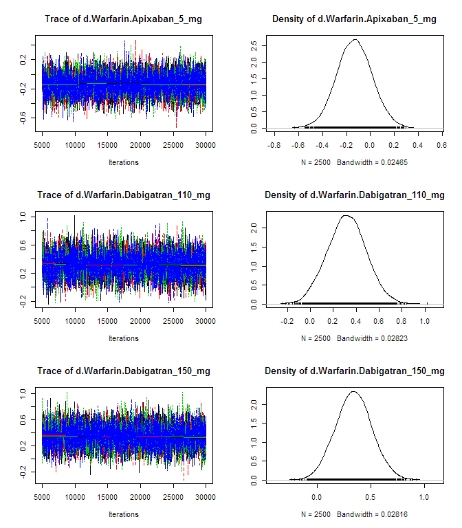

# NOAC network meta-analysis: MI
Benjamin Chan  
`r Sys.time()`  

[Back](README.md) to main page.

Read data.


```r
D <- readSheet("MI")
```

Tidy up the data and bias the warfarin arm of ROCKET-AF in favor of warfarin.


```r
D <- tidyData(D)
D <- biasROCKETAF()
write.csv(D, file="mtcMIData.csv", row.names=FALSE)
print(xtable(D, digits=rep(0, 5)), type="html", include.rownames=FALSE)
```

<!-- html table generated in R 3.2.2 by xtable 1.7-4 package -->
<!-- Tue Feb 23 16:16:09 2016 -->
<table border=1>
<tr> <th> study </th> <th> treatment </th> <th> responders </th> <th> sampleSize </th>  </tr>
  <tr> <td> ARISTOTLE </td> <td> Apixaban_5_mg </td> <td align="right"> 90 </td> <td align="right"> 9120 </td> </tr>
  <tr> <td> ARISTOTLE </td> <td> Warfarin </td> <td align="right"> 102 </td> <td align="right"> 9081 </td> </tr>
  <tr> <td> ARISTOTLE-J </td> <td> Apixaban_5_mg </td> <td align="right"> 0 </td> <td align="right"> 74 </td> </tr>
  <tr> <td> ARISTOTLE-J </td> <td> Warfarin </td> <td align="right"> 0 </td> <td align="right"> 74 </td> </tr>
  <tr> <td> ENGAGE AF-TIMI </td> <td> Edoxaban_30_mg </td> <td align="right"> 169 </td> <td align="right"> 7034 </td> </tr>
  <tr> <td> ENGAGE AF-TIMI </td> <td> Edoxaban_60_mg </td> <td align="right"> 133 </td> <td align="right"> 7035 </td> </tr>
  <tr> <td> ENGAGE AF-TIMI </td> <td> Warfarin </td> <td align="right"> 141 </td> <td align="right"> 7036 </td> </tr>
  <tr> <td> J-ROCKET </td> <td> Rivaroxaban_15_mg </td> <td align="right"> 3 </td> <td align="right"> 637 </td> </tr>
  <tr> <td> J-ROCKET </td> <td> Warfarin </td> <td align="right"> 1 </td> <td align="right"> 637 </td> </tr>
  <tr> <td> RE-LY </td> <td> Dabigatran_110_mg </td> <td align="right"> 86 </td> <td align="right"> 6015 </td> </tr>
  <tr> <td> RE-LY </td> <td> Dabigatran_150_mg </td> <td align="right"> 89 </td> <td align="right"> 6076 </td> </tr>
  <tr> <td> RE-LY </td> <td> Warfarin </td> <td align="right"> 63 </td> <td align="right"> 6022 </td> </tr>
  <tr> <td> ROCKET-AF </td> <td> Rivaroxaban_20_mg </td> <td align="right"> 100 </td> <td align="right"> 7061 </td> </tr>
  <tr> <td> ROCKET-AF </td> <td> Warfarin </td> <td align="right"> 113 </td> <td align="right"> 7082 </td> </tr>
   </table>

```r
network <- mtc.network(D)
```

Run the model using fixed-effects.


```r
M <- mtc.model(network, type="consistency", linearModel=effect)
plot(M)
```

 

```r
results <- mtc.run(M, n.adapt=nAdapt, n.iter=nIter, thin=thin)
```

# Summary

Direct and indirect odds ratios and 95% confidence bounds are stored in
[mtcMIOddsRatios.csv](mtcMIOddsRatios.csv).


```r
or <- combineResults()
write.csv(or, file="mtcMIOddsRatios.csv", row.names=FALSE)
print(xtable(or), type="html", include.rownames=FALSE)
```

<!-- html table generated in R 3.2.2 by xtable 1.7-4 package -->
<!-- Tue Feb 23 16:16:24 2016 -->
<table border=1>
<tr> <th> treatment </th> <th> Apixaban 5 mg </th> <th> Dabigatran 110 mg </th> <th> Dabigatran 150 mg </th> <th> Edoxaban 30 mg </th> <th> Edoxaban 60 mg </th> <th> Rivaroxaban 15 mg </th> <th> Rivaroxaban 20 mg </th> <th> Warfarin </th>  </tr>
  <tr> <td> Apixaban 5 mg vs </td> <td>  </td> <td> 0.64 (0.41, 0.99) </td> <td> 0.62 (0.40, 0.96) </td> <td> 0.73 (0.51, 1.05) </td> <td> 0.93 (0.64, 1.34) </td> <td> 0.23 (0.01, 2.07) </td> <td> 0.99 (0.67, 1.46) </td> <td> 0.88 (0.66, 1.17) </td> </tr>
  <tr> <td> Dabigatran 110 mg vs </td> <td> 1.57 (1.01, 2.46) </td> <td>  </td> <td> 0.97 (0.72, 1.32) </td> <td> 1.14 (0.77, 1.70) </td> <td> 1.47 (0.98, 2.21) </td> <td> 0.37 (0.01, 3.25) </td> <td> 1.55 (1.02, 2.38) </td> <td> 1.38 (1.00, 1.92) </td> </tr>
  <tr> <td> Dabigatran 150 mg vs </td> <td> 1.61 (1.04, 2.47) </td> <td> 1.03 (0.76, 1.39) </td> <td>  </td> <td> 1.17 (0.79, 1.76) </td> <td> 1.50 (1.01, 2.26) </td> <td> 0.38 (0.01, 3.31) </td> <td> 1.59 (1.05, 2.46) </td> <td> 1.41 (1.03, 1.97) </td> </tr>
  <tr> <td> Edoxaban 30 mg vs </td> <td> 1.37 (0.95, 1.96) </td> <td> 0.87 (0.59, 1.30) </td> <td> 0.85 (0.57, 1.27) </td> <td>  </td> <td> 1.28 (1.02, 1.61) </td> <td> 0.32 (0.01, 2.78) </td> <td> 1.36 (0.95, 1.93) </td> <td> 1.20 (0.96, 1.51) </td> </tr>
  <tr> <td> Edoxaban 60 mg vs </td> <td> 1.07 (0.74, 1.55) </td> <td> 0.68 (0.45, 1.03) </td> <td> 0.67 (0.44, 0.99) </td> <td> 0.78 (0.62, 0.98) </td> <td>  </td> <td> 0.25 (0.01, 2.21) </td> <td> 1.06 (0.73, 1.52) </td> <td> 0.94 (0.74, 1.19) </td> </tr>
  <tr> <td> Rivaroxaban 15 mg vs </td> <td> 4.27 (0.48, 118.41) </td> <td> 2.70 (0.31, 75.48) </td> <td> 2.64 (0.30, 74.07) </td> <td> 3.10 (0.36, 91.17) </td> <td> 4.00 (0.45, 114.98) </td> <td>  </td> <td> 4.21 (0.48, 120.68) </td> <td> 3.76 (0.43, 106.12) </td> </tr>
  <tr> <td> Rivaroxaban 20 mg vs </td> <td> 1.01 (0.68, 1.50) </td> <td> 0.64 (0.42, 0.98) </td> <td> 0.63 (0.41, 0.96) </td> <td> 0.74 (0.52, 1.05) </td> <td> 0.94 (0.66, 1.36) </td> <td> 0.24 (0.01, 2.09) </td> <td>  </td> <td> 0.89 (0.68, 1.17) </td> </tr>
  <tr> <td> Warfarin vs </td> <td> 1.14 (0.85, 1.51) </td> <td> 0.73 (0.52, 1.00) </td> <td> 0.71 (0.51, 0.97) </td> <td> 0.83 (0.66, 1.04) </td> <td> 1.06 (0.84, 1.35) </td> <td> 0.27 (0.01, 2.31) </td> <td> 1.13 (0.86, 1.48) </td> <td>  </td> </tr>
   </table>

# Forest plots, NOAC vs NOAC


```r
noac <- unique(D[treatment != "Warfarin", treatment])
for (i in 1:length(noac)) {
  forest(relative.effect(results, noac[i], noac[1:length(noac) != i]))
}
```

       

# Diagnostics


```r
summary(results)
```

```
## $measure
## [1] "Log Odds Ratio"
## 
## $summaries
## 
## Iterations = 5010:30000
## Thinning interval = 10 
## Number of chains = 4 
## Sample size per chain = 2500 
## 
## 1. Empirical mean and standard deviation for each variable,
##    plus standard error of the mean:
## 
##                                  Mean     SD Naive SE Time-series SE
## d.Warfarin.Apixaban_5_mg     -0.12909 0.1454 0.001454       0.001504
## d.Warfarin.Dabigatran_110_mg  0.32217 0.1671 0.001671       0.001973
## d.Warfarin.Dabigatran_150_mg  0.34691 0.1665 0.001665       0.001757
## d.Warfarin.Edoxaban_30_mg     0.18671 0.1155 0.001155       0.001286
## d.Warfarin.Edoxaban_60_mg    -0.06129 0.1219 0.001219       0.001260
## d.Warfarin.Rivaroxaban_15_mg  1.48057 1.3991 0.013991       0.014253
## d.Warfarin.Rivaroxaban_20_mg -0.11888 0.1388 0.001388       0.001430
## 
## 2. Quantiles for each variable:
## 
##                                    2.5%     25%      50%      75%  97.5%
## d.Warfarin.Apixaban_5_mg     -0.4148372 -0.2264 -0.12874 -0.03359 0.1592
## d.Warfarin.Dabigatran_110_mg -0.0001608  0.2070  0.31970  0.43581 0.6525
## d.Warfarin.Dabigatran_150_mg  0.0286421  0.2322  0.34524  0.46134 0.6784
## d.Warfarin.Edoxaban_30_mg    -0.0426112  0.1103  0.18585  0.26421 0.4111
## d.Warfarin.Edoxaban_60_mg    -0.3019212 -0.1423 -0.06091  0.01970 0.1740
## d.Warfarin.Rivaroxaban_15_mg -0.8364693  0.5551  1.32353  2.26569 4.6646
## d.Warfarin.Rivaroxaban_20_mg -0.3898118 -0.2129 -0.11840 -0.02424 0.1535
## 
## 
## $DIC
##     Dbar       pD      DIC 
## 12.28475 12.12104 24.40579 
## 
## attr(,"class")
## [1] "summary.mtc.result"
```

Sampler diagnostics.


```r
gelman.plot(results)
```

 

```r
gelman.diag(results)
```

```
## Potential scale reduction factors:
## 
##                              Point est. Upper C.I.
## d.Warfarin.Apixaban_5_mg              1          1
## d.Warfarin.Dabigatran_110_mg          1          1
## d.Warfarin.Dabigatran_150_mg          1          1
## d.Warfarin.Edoxaban_30_mg             1          1
## d.Warfarin.Edoxaban_60_mg             1          1
## d.Warfarin.Rivaroxaban_15_mg          1          1
## d.Warfarin.Rivaroxaban_20_mg          1          1
## 
## Multivariate psrf
## 
## 1
```


```r
plot(results)
```

  


```r
autocorr.plot(results$samples)
```

    

Assess the degree of heterogeneity and inconsistency.


```r
anohe <- mtc.anohe(network, n.adapt=nAdapt, n.iter=nIter, thin=thin)
```


```r
summary(anohe)
```

```
## Analysis of heterogeneity
## =========================
## 
## Per-comparison I-squared:
## -------------------------
## 
##                  t1                t2 i2.pair i2.cons incons.p
## 1     Apixaban_5_mg          Warfarin       0       0       NA
## 2 Dabigatran_110_mg Dabigatran_150_mg      NA      NA       NA
## 3 Dabigatran_110_mg          Warfarin      NA      NA       NA
## 4 Dabigatran_150_mg          Warfarin      NA      NA       NA
## 5    Edoxaban_30_mg    Edoxaban_60_mg      NA      NA       NA
## 6    Edoxaban_30_mg          Warfarin      NA      NA       NA
## 7    Edoxaban_60_mg          Warfarin      NA      NA       NA
## 8 Rivaroxaban_15_mg          Warfarin      NA      NA       NA
## 9 Rivaroxaban_20_mg          Warfarin      NA      NA       NA
## 
## Global I-squared:
## -------------------------
## 
##   i2.pair i2.cons
## 1       0       0
```

```r
plot(anohe)
```

```
## Analysis of heterogeneity -- convergence plots
## Unrelated Study Effects (USE) model:
```

  

```
## Unrelated Mean Effects (UME) model:
```

    

```
## Consistency model:
```

  
