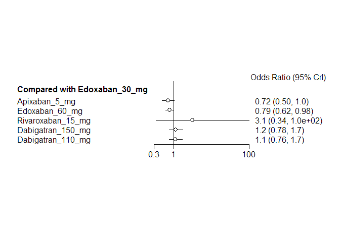
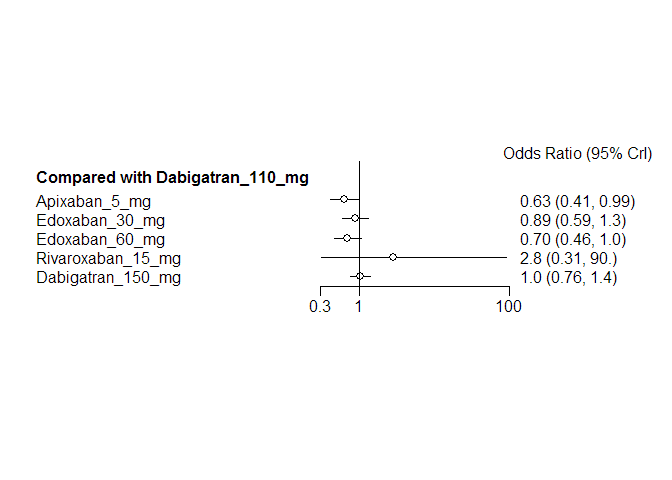
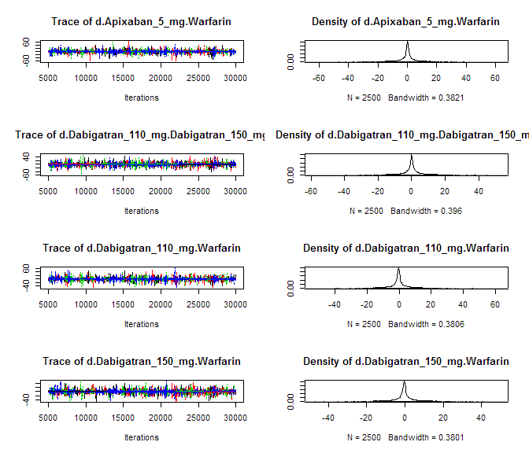

# NOAC network meta-analysis: MI
Benjamin Chan  
`r Sys.time()`  

[Back](README.md) to main page.

Read data.


```r
D <- readSheet("MI")
```

Tidy up the data (do not show the code).

<!-- html table generated in R 3.2.2 by xtable 1.7-4 package -->
<!-- Wed Feb 24 11:18:31 2016 -->
<table border=1>
<tr> <th> study </th> <th> treatment </th> <th> responders </th> <th> sampleSize </th>  </tr>
  <tr> <td> ARISTOTLE </td> <td> Apixaban_5_mg </td> <td align="right"> 90 </td> <td align="right"> 9120 </td> </tr>
  <tr> <td> ARISTOTLE </td> <td> Warfarin </td> <td align="right"> 102 </td> <td align="right"> 9081 </td> </tr>
  <tr> <td> ARISTOTLE-J </td> <td> Apixaban_5_mg </td> <td align="right"> 0 </td> <td align="right"> 74 </td> </tr>
  <tr> <td> ARISTOTLE-J </td> <td> Warfarin </td> <td align="right"> 0 </td> <td align="right"> 74 </td> </tr>
  <tr> <td> ENGAGE AF-TIMI </td> <td> Edoxaban_30_mg </td> <td align="right"> 169 </td> <td align="right"> 7034 </td> </tr>
  <tr> <td> ENGAGE AF-TIMI </td> <td> Edoxaban_60_mg </td> <td align="right"> 133 </td> <td align="right"> 7035 </td> </tr>
  <tr> <td> ENGAGE AF-TIMI </td> <td> Warfarin </td> <td align="right"> 141 </td> <td align="right"> 7036 </td> </tr>
  <tr> <td> J-ROCKET </td> <td> Rivaroxaban_15_mg </td> <td align="right"> 3 </td> <td align="right"> 637 </td> </tr>
  <tr> <td> J-ROCKET </td> <td> Warfarin </td> <td align="right"> 1 </td> <td align="right"> 637 </td> </tr>
  <tr> <td> RE-LY </td> <td> Dabigatran_110_mg </td> <td align="right"> 86 </td> <td align="right"> 6015 </td> </tr>
  <tr> <td> RE-LY </td> <td> Dabigatran_150_mg </td> <td align="right"> 89 </td> <td align="right"> 6076 </td> </tr>
  <tr> <td> RE-LY </td> <td> Warfarin </td> <td align="right"> 63 </td> <td align="right"> 6022 </td> </tr>
  <tr> <td> ROCKET-AF </td> <td> Rivaroxaban_20_mg </td> <td align="right"> 100 </td> <td align="right"> 7061 </td> </tr>
  <tr> <td> ROCKET-AF </td> <td> Warfarin </td> <td align="right"> 126 </td> <td align="right"> 7082 </td> </tr>
   </table>

Run the model using fixed-effects.


```r
M <- mtc.model(network, type="consistency", linearModel=effect)
plot(M)
```

 

```r
results <- mtc.run(M, n.adapt=nAdapt, n.iter=nIter, thin=thin)
```

# Summary

Direct and indirect odds ratios and 95% confidence bounds are stored in
[mtcMIOddsRatios.csv](mtcMIOddsRatios.csv).


```r
or <- combineResults()
write.csv(or, file="mtcMIOddsRatios.csv", row.names=FALSE)
print(xtable(or), type="html", include.rownames=FALSE)
```

<!-- html table generated in R 3.2.2 by xtable 1.7-4 package -->
<!-- Wed Feb 24 11:18:49 2016 -->
<table border=1>
<tr> <th> treatment </th> <th> Apixaban 5 mg </th> <th> Dabigatran 110 mg </th> <th> Dabigatran 150 mg </th> <th> Edoxaban 30 mg </th> <th> Edoxaban 60 mg </th> <th> Rivaroxaban 15 mg </th> <th> Rivaroxaban 20 mg </th> <th> Warfarin </th>  </tr>
  <tr> <td> Apixaban 5 mg vs </td> <td>  </td> <td> 0.64 (0.41, 0.99) </td> <td> 0.62 (0.40, 0.96) </td> <td> 0.73 (0.51, 1.04) </td> <td> 0.93 (0.64, 1.35) </td> <td> 0.23 (0.01, 2.09) </td> <td> 1.10 (0.75, 1.62) </td> <td> 0.87 (0.66, 1.16) </td> </tr>
  <tr> <td> Dabigatran 110 mg vs </td> <td> 1.57 (1.01, 2.42) </td> <td>  </td> <td> 0.97 (0.72, 1.32) </td> <td> 1.14 (0.76, 1.70) </td> <td> 1.46 (0.96, 2.21) </td> <td> 0.36 (0.01, 3.28) </td> <td> 1.73 (1.12, 2.65) </td> <td> 1.37 (0.98, 1.91) </td> </tr>
  <tr> <td> Dabigatran 150 mg vs </td> <td> 1.60 (1.05, 2.49) </td> <td> 1.03 (0.76, 1.39) </td> <td>  </td> <td> 1.17 (0.78, 1.74) </td> <td> 1.49 (1.00, 2.26) </td> <td> 0.37 (0.01, 3.34) </td> <td> 1.77 (1.17, 2.72) </td> <td> 1.40 (1.02, 1.95) </td> </tr>
  <tr> <td> Edoxaban 30 mg vs </td> <td> 1.38 (0.96, 1.97) </td> <td> 0.88 (0.59, 1.32) </td> <td> 0.86 (0.58, 1.28) </td> <td>  </td> <td> 1.28 (1.02, 1.61) </td> <td> 0.31 (0.01, 2.82) </td> <td> 1.52 (1.07, 2.14) </td> <td> 1.20 (0.96, 1.51) </td> </tr>
  <tr> <td> Edoxaban 60 mg vs </td> <td> 1.08 (0.74, 1.55) </td> <td> 0.69 (0.45, 1.04) </td> <td> 0.67 (0.44, 1.00) </td> <td> 0.78 (0.62, 0.98) </td> <td>  </td> <td> 0.25 (0.01, 2.21) </td> <td> 1.19 (0.82, 1.69) </td> <td> 0.94 (0.74, 1.19) </td> </tr>
  <tr> <td> Rivaroxaban 15 mg vs </td> <td> 4.40 (0.48, 146.17) </td> <td> 2.77 (0.30, 91.77) </td> <td> 2.70 (0.30, 90.46) </td> <td> 3.18 (0.36, 105.90) </td> <td> 4.06 (0.45, 135.85) </td> <td>  </td> <td> 4.81 (0.54, 161.48) </td> <td> 3.81 (0.43, 127.08) </td> </tr>
  <tr> <td> Rivaroxaban 20 mg vs </td> <td> 0.91 (0.62, 1.34) </td> <td> 0.58 (0.38, 0.90) </td> <td> 0.57 (0.37, 0.86) </td> <td> 0.66 (0.47, 0.94) </td> <td> 0.84 (0.59, 1.21) </td> <td> 0.21 (0.01, 1.86) </td> <td>  </td> <td> 0.79 (0.61, 1.03) </td> </tr>
  <tr> <td> Warfarin vs </td> <td> 1.14 (0.86, 1.52) </td> <td> 0.73 (0.52, 1.02) </td> <td> 0.71 (0.51, 0.98) </td> <td> 0.83 (0.66, 1.04) </td> <td> 1.06 (0.84, 1.35) </td> <td> 0.26 (0.01, 2.31) </td> <td> 1.26 (0.97, 1.64) </td> <td>  </td> </tr>
   </table>

# Forest plots, NOAC vs NOAC


```r
noac <- unique(D[treatment != "Warfarin", treatment])
for (i in 1:length(noac)) {
  forest(relative.effect(results, noac[i], noac[1:length(noac) != i]))
}
```

       

# Diagnostics


```r
summary(results)
```

```
## $measure
## [1] "Log Odds Ratio"
## 
## $summaries
## 
## Iterations = 5010:30000
## Thinning interval = 10 
## Number of chains = 4 
## Sample size per chain = 2500 
## 
## 1. Empirical mean and standard deviation for each variable,
##    plus standard error of the mean:
## 
##                                  Mean     SD Naive SE Time-series SE
## d.Warfarin.Apixaban_5_mg     -0.13399 0.1442 0.001442       0.001473
## d.Warfarin.Dabigatran_110_mg  0.31428 0.1693 0.001693       0.001888
## d.Warfarin.Dabigatran_150_mg  0.34016 0.1668 0.001668       0.001720
## d.Warfarin.Edoxaban_30_mg     0.18461 0.1144 0.001144       0.001264
## d.Warfarin.Edoxaban_60_mg    -0.06112 0.1222 0.001222       0.001223
## d.Warfarin.Rivaroxaban_15_mg  1.50094 1.4224 0.014224       0.014375
## d.Warfarin.Rivaroxaban_20_mg -0.23186 0.1359 0.001359       0.001445
## 
## 2. Quantiles for each variable:
## 
##                                  2.5%     25%      50%      75%   97.5%
## d.Warfarin.Apixaban_5_mg     -0.41971 -0.2301 -0.13405 -0.03532 0.14822
## d.Warfarin.Dabigatran_110_mg -0.01689  0.1990  0.31430  0.42873 0.64459
## d.Warfarin.Dabigatran_150_mg  0.01709  0.2259  0.33920  0.45318 0.66974
## d.Warfarin.Edoxaban_30_mg    -0.03817  0.1067  0.18459  0.26166 0.41036
## d.Warfarin.Edoxaban_60_mg    -0.29987 -0.1436 -0.06229  0.02195 0.17611
## d.Warfarin.Rivaroxaban_15_mg -0.83571  0.5326  1.33889  2.28884 4.84478
## d.Warfarin.Rivaroxaban_20_mg -0.49655 -0.3237 -0.23342 -0.14022 0.03394
## 
## 
## $DIC
##     Dbar       pD      DIC 
## 12.37824 12.20649 24.58473 
## 
## attr(,"class")
## [1] "summary.mtc.result"
```

Sampler diagnostics.


```r
gelman.plot(results)
```

 

```r
gelman.diag(results)
```

```
## Potential scale reduction factors:
## 
##                              Point est. Upper C.I.
## d.Warfarin.Apixaban_5_mg              1          1
## d.Warfarin.Dabigatran_110_mg          1          1
## d.Warfarin.Dabigatran_150_mg          1          1
## d.Warfarin.Edoxaban_30_mg             1          1
## d.Warfarin.Edoxaban_60_mg             1          1
## d.Warfarin.Rivaroxaban_15_mg          1          1
## d.Warfarin.Rivaroxaban_20_mg          1          1
## 
## Multivariate psrf
## 
## 1
```


```r
plot(results)
```

  


```r
autocorr.plot(results$samples)
```

    

Assess the degree of heterogeneity and inconsistency.


```r
anohe <- mtc.anohe(network, n.adapt=nAdapt, n.iter=nIter, thin=thin)
```


```r
summary(anohe)
```

```
## Analysis of heterogeneity
## =========================
## 
## Per-comparison I-squared:
## -------------------------
## 
##                  t1                t2 i2.pair i2.cons incons.p
## 1     Apixaban_5_mg          Warfarin       0       0       NA
## 2 Dabigatran_110_mg Dabigatran_150_mg      NA      NA       NA
## 3 Dabigatran_110_mg          Warfarin      NA      NA       NA
## 4 Dabigatran_150_mg          Warfarin      NA      NA       NA
## 5    Edoxaban_30_mg    Edoxaban_60_mg      NA      NA       NA
## 6    Edoxaban_30_mg          Warfarin      NA      NA       NA
## 7    Edoxaban_60_mg          Warfarin      NA      NA       NA
## 8 Rivaroxaban_15_mg          Warfarin      NA      NA       NA
## 9 Rivaroxaban_20_mg          Warfarin      NA      NA       NA
## 
## Global I-squared:
## -------------------------
## 
##   i2.pair i2.cons
## 1       0       0
```

```r
plot(anohe)
```

```
## Analysis of heterogeneity -- convergence plots
## Unrelated Study Effects (USE) model:
```

  

```
## Unrelated Mean Effects (UME) model:
```

    

```
## Consistency model:
```

  
