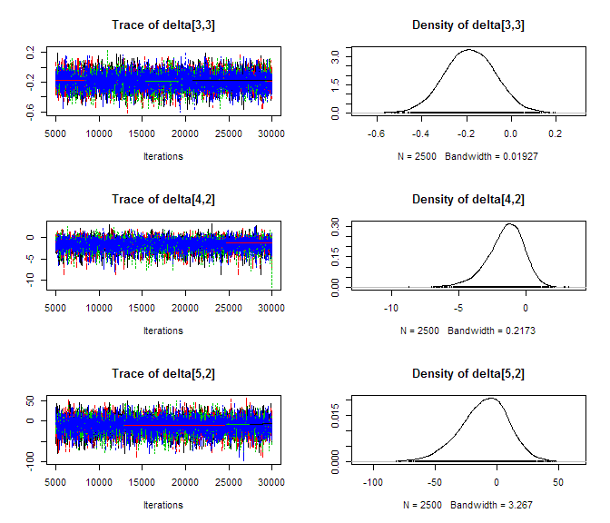
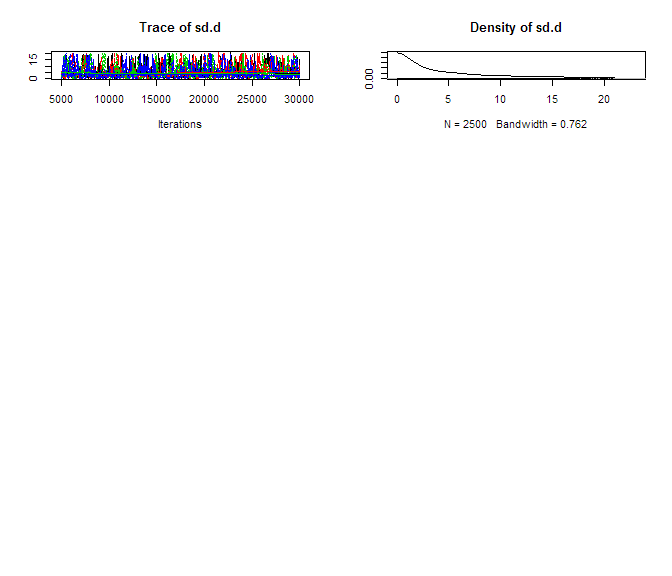

# NOAC network meta-analysis: MI
Benjamin Chan  
`r Sys.time()`  

[Back](README.md) to main page.

Clean up the data (do not show the code).


```
##              study         treatment responders sampleSize
##  1:          RE-LY Dabigatran_110_mg         86       6015
##  2:          RE-LY Dabigatran_150_mg         89       6076
##  3:          RE-LY          Warfarin         63       6022
##  4:      ARISTOTLE     Apixaban_5_mg         90       9120
##  5:      ARISTOTLE          Warfarin        102       9081
##  6:      ROCKET-AF Rivaroxaban_20_mg        101       7131
##  7:      ROCKET-AF          Warfarin        126       7133
##  8: ENGAGE AF-TIMI    Edoxaban_30_mg        169       7034
##  9: ENGAGE AF-TIMI    Edoxaban_60_mg        133       7035
## 10: ENGAGE AF-TIMI          Warfarin        141       7036
```

Run the model using fixed-effects.


```r
M <- mtc.model(network, type="consistency", linearModel=effect)
plot(M)
```

 

```r
results <- mtc.run(M, n.adapt=nAdapt, n.iter=nIter, thin=thin)
```

# Summary

Direct and indirect odds ratios and 95% confidence bounds are stored in
[mtcMIOddsRatios.csv](mtcMIOddsRatios.csv).


```r
or <- combineResults()
write.csv(or, file="mtcMIOddsRatios.csv", row.names=FALSE)
show(or)
```

```
##               treatment     Apixaban 5 mg Dabigatran 110 mg
## 1:     Apixaban 5 mg vs                NA 0.64 (0.41, 0.98)
## 2: Dabigatran 110 mg vs 1.57 (1.02, 2.45)                NA
## 3: Dabigatran 150 mg vs 1.61 (1.06, 2.47) 1.02 (0.76, 1.39)
## 4:    Edoxaban 30 mg vs 1.37 (0.96, 1.97) 0.88 (0.58, 1.30)
## 5:    Edoxaban 60 mg vs 1.07 (0.75, 1.55) 0.69 (0.45, 1.02)
## 6: Rivaroxaban 20 mg vs 0.91 (0.61, 1.34) 0.58 (0.37, 0.88)
## 7:          Warfarin vs 1.14 (0.85, 1.51) 0.73 (0.52, 1.00)
##    Dabigatran 150 mg    Edoxaban 30 mg    Edoxaban 60 mg Rivaroxaban 20 mg
## 1: 0.62 (0.40, 0.95) 0.73 (0.51, 1.04) 0.93 (0.64, 1.34) 1.10 (0.75, 1.64)
## 2: 0.98 (0.72, 1.32) 1.14 (0.77, 1.73) 1.46 (0.98, 2.21) 1.72 (1.14, 2.68)
## 3:                NA 1.17 (0.79, 1.74) 1.50 (1.00, 2.26) 1.77 (1.17, 2.72)
## 4: 0.85 (0.57, 1.27)                NA 1.28 (1.02, 1.61) 1.51 (1.07, 2.15)
## 5: 0.66 (0.44, 1.00) 0.78 (0.62, 0.98)                NA 1.18 (0.82, 1.68)
## 6: 0.57 (0.37, 0.86) 0.66 (0.46, 0.94) 0.85 (0.59, 1.22)                NA
## 7: 0.71 (0.51, 0.97) 0.83 (0.66, 1.04) 1.06 (0.84, 1.36) 1.25 (0.96, 1.63)
##             Warfarin
## 1: 0.88 (0.66, 1.17)
## 2: 1.38 (1.00, 1.93)
## 3: 1.42 (1.03, 1.96)
## 4: 1.20 (0.96, 1.52)
## 5: 0.94 (0.74, 1.20)
## 6: 0.80 (0.61, 1.04)
## 7:                NA
```

# Diagnostics


```r
summary(results)
```

```
## $measure
## [1] "Log Odds Ratio"
## 
## $summaries
## 
## Iterations = 5010:30000
## Thinning interval = 10 
## Number of chains = 4 
## Sample size per chain = 2500 
## 
## 1. Empirical mean and standard deviation for each variable,
##    plus standard error of the mean:
## 
##                                  Mean     SD Naive SE Time-series SE
## d.Warfarin.Apixaban_5_mg     -0.13053 0.1440 0.001440       0.001477
## d.Warfarin.Dabigatran_110_mg  0.32227 0.1678 0.001678       0.001873
## d.Warfarin.Dabigatran_150_mg  0.34698 0.1649 0.001649       0.001684
## d.Warfarin.Edoxaban_30_mg     0.18815 0.1161 0.001161       0.001290
## d.Warfarin.Edoxaban_60_mg    -0.05977 0.1226 0.001226       0.001282
## d.Warfarin.Rivaroxaban_20_mg -0.22363 0.1357 0.001357       0.001352
## 
## 2. Quantiles for each variable:
## 
##                                   2.5%     25%      50%      75%   97.5%
## d.Warfarin.Apixaban_5_mg     -0.411817 -0.2252 -0.12981 -0.03551 0.15741
## d.Warfarin.Dabigatran_110_mg  0.001229  0.2073  0.31850  0.43401 0.65590
## d.Warfarin.Dabigatran_150_mg  0.026003  0.2337  0.34725  0.45811 0.67293
## d.Warfarin.Edoxaban_30_mg    -0.038517  0.1109  0.18633  0.26674 0.41784
## d.Warfarin.Edoxaban_60_mg    -0.306105 -0.1412 -0.06059  0.02293 0.17956
## d.Warfarin.Rivaroxaban_20_mg -0.489573 -0.3152 -0.22407 -0.13068 0.03795
## 
## 
## $DIC
##     Dbar       pD      DIC 
## 10.01916 10.01695 20.03611 
## 
## attr(,"class")
## [1] "summary.mtc.result"
```

Sampler diagnostics.


```r
gelman.plot(results)
```

 

```r
gelman.diag(results)
```

```
## Potential scale reduction factors:
## 
##                              Point est. Upper C.I.
## d.Warfarin.Apixaban_5_mg              1       1.00
## d.Warfarin.Dabigatran_110_mg          1       1.01
## d.Warfarin.Dabigatran_150_mg          1       1.00
## d.Warfarin.Edoxaban_30_mg             1       1.00
## d.Warfarin.Edoxaban_60_mg             1       1.00
## d.Warfarin.Rivaroxaban_20_mg          1       1.00
## 
## Multivariate psrf
## 
## 1
```


```r
plot(results)
```

  


```r
autocorr.plot(results$samples)
```

    

Assess the degree of heterogeneity and inconsistency.


```r
anohe <- mtc.anohe(network, n.adapt=nAdapt, n.iter=nIter, thin=thin)
```


```r
summary(anohe)
```

```
## Analysis of heterogeneity
## =========================
## 
## Per-comparison I-squared:
## -------------------------
## 
##                  t1                t2 i2.pair i2.cons incons.p
## 1     Apixaban_5_mg          Warfarin      NA      NA       NA
## 2 Dabigatran_110_mg Dabigatran_150_mg      NA      NA       NA
## 3 Dabigatran_110_mg          Warfarin      NA      NA       NA
## 4 Dabigatran_150_mg          Warfarin      NA      NA       NA
## 5    Edoxaban_30_mg    Edoxaban_60_mg      NA      NA       NA
## 6    Edoxaban_30_mg          Warfarin      NA      NA       NA
## 7    Edoxaban_60_mg          Warfarin      NA      NA       NA
## 8 Rivaroxaban_20_mg          Warfarin      NA      NA       NA
## 
## Global I-squared:
## -------------------------
## 
##   i2.pair i2.cons
## 1       0       0
```

```r
plot(anohe)
```

```
## Analysis of heterogeneity -- convergence plots
## Unrelated Study Effects (USE) model:
```

  

```
## Unrelated Mean Effects (UME) model:
```

   

```
## Consistency model:
```

  
