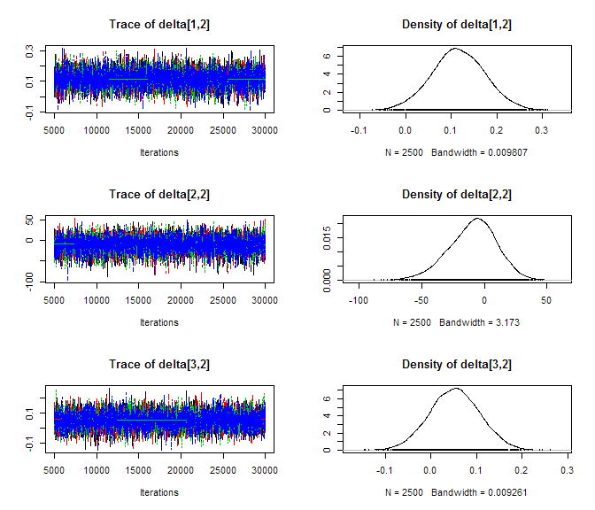
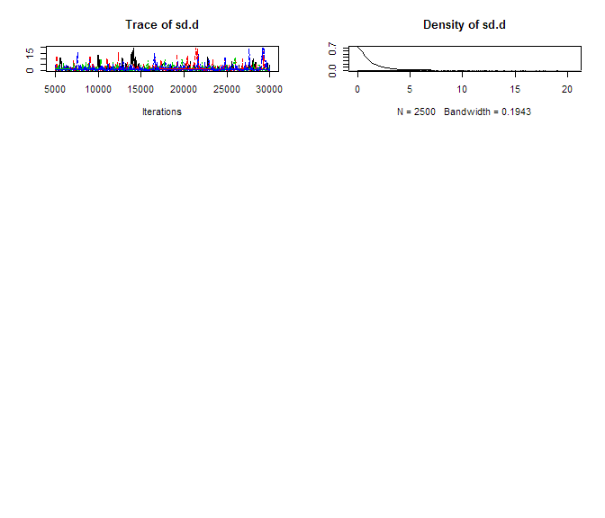

# NOAC network meta-analysis: Mortality
Benjamin Chan  
`r Sys.time()`  

[Back](README.md) to main page.

Clean up the data (do not show the code).

<!-- html table generated in R 3.2.2 by xtable 1.7-4 package -->
<!-- Fri Feb 05 12:53:33 2016 -->
<table border=1>
<tr> <th> study </th> <th> treatment </th> <th> responders </th> <th> sampleSize </th>  </tr>
  <tr> <td> RE-LY </td> <td> Dabigatran_110_mg </td> <td align="right"> 446 </td> <td align="right"> 6015 </td> </tr>
  <tr> <td> RE-LY </td> <td> Dabigatran_150_mg </td> <td align="right"> 438 </td> <td align="right"> 6076 </td> </tr>
  <tr> <td> RE-LY </td> <td> Warfarin </td> <td align="right"> 487 </td> <td align="right"> 6022 </td> </tr>
  <tr> <td> ARISTOTLE </td> <td> Apixaban_5_mg </td> <td align="right"> 603 </td> <td align="right"> 9120 </td> </tr>
  <tr> <td> ARISTOTLE </td> <td> Warfarin </td> <td align="right"> 669 </td> <td align="right"> 9081 </td> </tr>
  <tr> <td> ROCKET-AF </td> <td> Rivaroxaban_20_mg </td> <td align="right"> 208 </td> <td align="right"> 7061 </td> </tr>
  <tr> <td> ROCKET-AF </td> <td> Warfarin </td> <td align="right"> 250 </td> <td align="right"> 7062 </td> </tr>
  <tr> <td> ENGAGE AF-TIMI </td> <td> Edoxaban_30_mg </td> <td align="right"> 737 </td> <td align="right"> 7034 </td> </tr>
  <tr> <td> ENGAGE AF-TIMI </td> <td> Edoxaban_60_mg </td> <td align="right"> 773 </td> <td align="right"> 7035 </td> </tr>
  <tr> <td> ENGAGE AF-TIMI </td> <td> Warfarin </td> <td align="right"> 839 </td> <td align="right"> 7036 </td> </tr>
   </table>

Run the model using fixed-effects.


```r
M <- mtc.model(network, type="consistency", linearModel=effect)
plot(M)
```

 

```r
results <- mtc.run(M, n.adapt=nAdapt, n.iter=nIter, thin=thin)
```

# Summary

Direct and indirect odds ratios and 95% confidence bounds are stored in
[mtcMortalityOddsRatios.csv](mtcMortalityOddsRatios.csv).


```r
or <- combineResults()
write.csv(or, file="mtcMortalityOddsRatios.csv", row.names=FALSE)
print(xtable(or), type="html", include.rownames=FALSE)
```

<!-- html table generated in R 3.2.2 by xtable 1.7-4 package -->
<!-- Fri Feb 05 12:53:46 2016 -->
<table border=1>
<tr> <th> treatment </th> <th> Apixaban 5 mg </th> <th> Dabigatran 110 mg </th> <th> Dabigatran 150 mg </th> <th> Edoxaban 30 mg </th> <th> Edoxaban 60 mg </th> <th> Rivaroxaban 20 mg </th> <th> Warfarin </th>  </tr>
  <tr> <td> Apixaban 5 mg vs </td> <td>  </td> <td> 0.98 (0.82, 1.16) </td> <td> 1.01 (0.84, 1.20) </td> <td> 1.03 (0.88, 1.20) </td> <td> 0.98 (0.84, 1.14) </td> <td> 1.08 (0.86, 1.34) </td> <td> 0.89 (0.80, 1.00) </td> </tr>
  <tr> <td> Dabigatran 110 mg vs </td> <td> 1.02 (0.86, 1.22) </td> <td>  </td> <td> 1.03 (0.90, 1.18) </td> <td> 1.05 (0.89, 1.25) </td> <td> 1.00 (0.85, 1.18) </td> <td> 1.10 (0.87, 1.38) </td> <td> 0.91 (0.80, 1.04) </td> </tr>
  <tr> <td> Dabigatran 150 mg vs </td> <td> 0.99 (0.83, 1.19) </td> <td> 0.97 (0.85, 1.11) </td> <td>  </td> <td> 1.02 (0.86, 1.21) </td> <td> 0.97 (0.82, 1.15) </td> <td> 1.07 (0.85, 1.34) </td> <td> 0.88 (0.77, 1.01) </td> </tr>
  <tr> <td> Edoxaban 30 mg vs </td> <td> 0.97 (0.83, 1.13) </td> <td> 0.95 (0.80, 1.12) </td> <td> 0.98 (0.82, 1.16) </td> <td>  </td> <td> 0.95 (0.85, 1.06) </td> <td> 1.04 (0.84, 1.29) </td> <td> 0.87 (0.78, 0.96) </td> </tr>
  <tr> <td> Edoxaban 60 mg vs </td> <td> 1.02 (0.88, 1.19) </td> <td> 1.00 (0.85, 1.18) </td> <td> 1.03 (0.87, 1.22) </td> <td> 1.05 (0.95, 1.17) </td> <td>  </td> <td> 1.10 (0.89, 1.36) </td> <td> 0.91 (0.82, 1.01) </td> </tr>
  <tr> <td> Rivaroxaban 20 mg vs </td> <td> 0.93 (0.75, 1.16) </td> <td> 0.91 (0.72, 1.14) </td> <td> 0.94 (0.75, 1.18) </td> <td> 0.96 (0.78, 1.19) </td> <td> 0.91 (0.73, 1.12) </td> <td>  </td> <td> 0.83 (0.69, 1.00) </td> </tr>
  <tr> <td> Warfarin vs </td> <td> 1.12 (1.00, 1.26) </td> <td> 1.10 (0.96, 1.25) </td> <td> 1.13 (0.99, 1.29) </td> <td> 1.16 (1.04, 1.28) </td> <td> 1.10 (0.99, 1.22) </td> <td> 1.21 (1.00, 1.46) </td> <td>  </td> </tr>
   </table>

# Diagnostics


```r
summary(results)
```

```
## $measure
## [1] "Log Odds Ratio"
## 
## $summaries
## 
## Iterations = 5010:30000
## Thinning interval = 10 
## Number of chains = 4 
## Sample size per chain = 2500 
## 
## 1. Empirical mean and standard deviation for each variable,
##    plus standard error of the mean:
## 
##                                  Mean      SD  Naive SE Time-series SE
## d.Warfarin.Apixaban_5_mg     -0.11543 0.05812 0.0005812      0.0006005
## d.Warfarin.Dabigatran_110_mg -0.09178 0.06801 0.0006801      0.0007603
## d.Warfarin.Dabigatran_150_mg -0.12359 0.06862 0.0006862      0.0006917
## d.Warfarin.Edoxaban_30_mg    -0.14473 0.05330 0.0005330      0.0006310
## d.Warfarin.Edoxaban_60_mg    -0.09225 0.05301 0.0005301      0.0005350
## d.Warfarin.Rivaroxaban_20_mg -0.18775 0.09538 0.0009538      0.0010390
## 
## 2. Quantiles for each variable:
## 
##                                 2.5%     25%      50%      75%      97.5%
## d.Warfarin.Apixaban_5_mg     -0.2285 -0.1560 -0.11514 -0.07519 -0.0014304
## d.Warfarin.Dabigatran_110_mg -0.2270 -0.1384 -0.09194 -0.04570  0.0410115
## d.Warfarin.Dabigatran_150_mg -0.2579 -0.1700 -0.12394 -0.07703  0.0124770
## d.Warfarin.Edoxaban_30_mg    -0.2505 -0.1815 -0.14421 -0.10732 -0.0432932
## d.Warfarin.Edoxaban_60_mg    -0.1965 -0.1280 -0.09145 -0.05678  0.0104174
## d.Warfarin.Rivaroxaban_20_mg -0.3776 -0.2520 -0.18769 -0.12362  0.0004035
## 
## 
## $DIC
##      Dbar        pD       DIC 
##  9.992174  9.986197 19.978371 
## 
## attr(,"class")
## [1] "summary.mtc.result"
```

Sampler diagnostics.


```r
gelman.plot(results)
```

 

```r
gelman.diag(results)
```

```
## Potential scale reduction factors:
## 
##                              Point est. Upper C.I.
## d.Warfarin.Apixaban_5_mg              1          1
## d.Warfarin.Dabigatran_110_mg          1          1
## d.Warfarin.Dabigatran_150_mg          1          1
## d.Warfarin.Edoxaban_30_mg             1          1
## d.Warfarin.Edoxaban_60_mg             1          1
## d.Warfarin.Rivaroxaban_20_mg          1          1
## 
## Multivariate psrf
## 
## 1
```


```r
plot(results)
```

  


```r
autocorr.plot(results$samples)
```

    

Assess the degree of heterogeneity and inconsistency.


```r
anohe <- mtc.anohe(network, n.adapt=nAdapt, n.iter=nIter, thin=thin)
```


```r
summary(anohe)
```

```
## Analysis of heterogeneity
## =========================
## 
## Per-comparison I-squared:
## -------------------------
## 
##                  t1                t2 i2.pair i2.cons incons.p
## 1     Apixaban_5_mg          Warfarin      NA      NA       NA
## 2 Dabigatran_110_mg Dabigatran_150_mg      NA      NA       NA
## 3 Dabigatran_110_mg          Warfarin      NA      NA       NA
## 4 Dabigatran_150_mg          Warfarin      NA      NA       NA
## 5    Edoxaban_30_mg    Edoxaban_60_mg      NA      NA       NA
## 6    Edoxaban_30_mg          Warfarin      NA      NA       NA
## 7    Edoxaban_60_mg          Warfarin      NA      NA       NA
## 8 Rivaroxaban_20_mg          Warfarin      NA      NA       NA
## 
## Global I-squared:
## -------------------------
## 
##   i2.pair i2.cons
## 1       0       0
```

```r
plot(anohe)
```

```
## Analysis of heterogeneity -- convergence plots
## Unrelated Study Effects (USE) model:
```

  

```
## Unrelated Mean Effects (UME) model:
```

   

```
## Consistency model:
```

  
