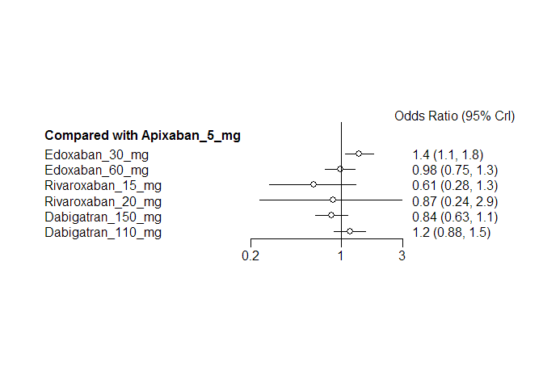
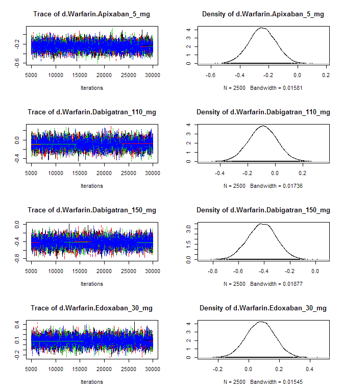

# NOAC network meta-analysis: Stroke
Benjamin Chan  
`r Sys.time()`  

[Back](README.md) to main page.

Read data.


```r
D <- readSheet("Strokeembolism")
```

Tidy up the data and bias the warfarin arm of ROCKET-AF to be similar to the Rivaroxaban arm.


```r
D <- tidyData(D)
D <- biasROCKETAF()
write.csv(D, file="mtcStrokeData.csv", row.names=FALSE)
print(xtable(D, digits=rep(0, 5)), type="html", include.rownames=FALSE)
```

<!-- html table generated in R 3.2.2 by xtable 1.7-4 package -->
<!-- Thu Feb 18 10:46:32 2016 -->
<table border=1>
<tr> <th> study </th> <th> treatment </th> <th> responders </th> <th> sampleSize </th>  </tr>
  <tr> <td> ARISTOTLE </td> <td> Apixaban_5_mg </td> <td align="right"> 212 </td> <td align="right"> 9120 </td> </tr>
  <tr> <td> ARISTOTLE </td> <td> Warfarin </td> <td align="right"> 265 </td> <td align="right"> 9081 </td> </tr>
  <tr> <td> ARISTOTLE-J </td> <td> Apixaban_5_mg </td> <td align="right"> 0 </td> <td align="right"> 74 </td> </tr>
  <tr> <td> ARISTOTLE-J </td> <td> Warfarin </td> <td align="right"> 3 </td> <td align="right"> 74 </td> </tr>
  <tr> <td> ENGAGE AF-TIMI </td> <td> Edoxaban_30_mg </td> <td align="right"> 253 </td> <td align="right"> 7002 </td> </tr>
  <tr> <td> ENGAGE AF-TIMI </td> <td> Edoxaban_60_mg </td> <td align="right"> 182 </td> <td align="right"> 7012 </td> </tr>
  <tr> <td> ENGAGE AF-TIMI </td> <td> Warfarin </td> <td align="right"> 232 </td> <td align="right"> 7012 </td> </tr>
  <tr> <td> J-ROCKET </td> <td> Rivaroxaban_15_mg </td> <td align="right"> 11 </td> <td align="right"> 637 </td> </tr>
  <tr> <td> J-ROCKET </td> <td> Warfarin </td> <td align="right"> 22 </td> <td align="right"> 637 </td> </tr>
  <tr> <td> Mao, 2014 </td> <td> Rivaroxaban_20_mg </td> <td align="right"> 5 </td> <td align="right"> 177 </td> </tr>
  <tr> <td> Mao, 2014 </td> <td> Warfarin </td> <td align="right"> 7 </td> <td align="right"> 176 </td> </tr>
  <tr> <td> PETRO </td> <td> Dabigatran_150_mg </td> <td align="right"> 0 </td> <td align="right"> 166 </td> </tr>
  <tr> <td> PETRO </td> <td> Warfarin </td> <td align="right"> 0 </td> <td align="right"> 70 </td> </tr>
  <tr> <td> RE-LY </td> <td> Dabigatran_110_mg </td> <td align="right"> 182 </td> <td align="right"> 6015 </td> </tr>
  <tr> <td> RE-LY </td> <td> Dabigatran_150_mg </td> <td align="right"> 134 </td> <td align="right"> 6076 </td> </tr>
  <tr> <td> RE-LY </td> <td> Warfarin </td> <td align="right"> 199 </td> <td align="right"> 6022 </td> </tr>
  <tr> <td> ROCKET-AF </td> <td> Rivaroxaban_20_mg </td> <td align="right"> 269 </td> <td align="right"> 7081 </td> </tr>
  <tr> <td> ROCKET-AF </td> <td> Warfarin </td> <td align="right"> 275 </td> <td align="right"> 7090 </td> </tr>
  <tr> <td> Yamashita, 2012 </td> <td> Edoxaban_30_mg </td> <td align="right"> 0 </td> <td align="right"> 131 </td> </tr>
  <tr> <td> Yamashita, 2012 </td> <td> Edoxaban_60_mg </td> <td align="right"> 0 </td> <td align="right"> 131 </td> </tr>
  <tr> <td> Yamashita, 2012 </td> <td> Warfarin </td> <td align="right"> 0 </td> <td align="right"> 129 </td> </tr>
   </table>

```r
network <- mtc.network(D)
```

Run the model using fixed-effects.


```r
M <- mtc.model(network, type="consistency", linearModel=effect)
plot(M)
```

 

```r
results <- mtc.run(M, n.adapt=nAdapt, n.iter=nIter, thin=thin)
```

# Summary

Direct and indirect odds ratios and 95% confidence bounds are stored in
[mtcStrokeOddsRatios.csv](mtcStrokeOddsRatios.csv).


```r
or <- combineResults()
write.csv(or, file="mtcStrokeOddsRatios.csv", row.names=FALSE)
print(xtable(or), type="html", include.rownames=FALSE)
```

<!-- html table generated in R 3.2.2 by xtable 1.7-4 package -->
<!-- Thu Feb 18 10:46:52 2016 -->
<table border=1>
<tr> <th> treatment </th> <th> Apixaban 5 mg </th> <th> Dabigatran 110 mg </th> <th> Dabigatran 150 mg </th> <th> Edoxaban 30 mg </th> <th> Edoxaban 60 mg </th> <th> Rivaroxaban 15 mg </th> <th> Rivaroxaban 20 mg </th> <th> Warfarin </th>  </tr>
  <tr> <td> Apixaban 5 mg vs </td> <td>  </td> <td> 0.86 (0.65, 1.13) </td> <td> 1.19 (0.89, 1.58) </td> <td> 0.71 (0.55, 0.92) </td> <td> 1.00 (0.77, 1.31) </td> <td> 1.60 (0.75, 3.53) </td> <td> 0.81 (0.62, 1.03) </td> <td> 0.78 (0.65, 0.94) </td> </tr>
  <tr> <td> Dabigatran 110 mg vs </td> <td> 1.17 (0.89, 1.54) </td> <td>  </td> <td> 1.39 (1.11, 1.74) </td> <td> 0.83 (0.64, 1.10) </td> <td> 1.17 (0.88, 1.56) </td> <td> 1.87 (0.89, 4.16) </td> <td> 0.94 (0.73, 1.24) </td> <td> 0.91 (0.74, 1.12) </td> </tr>
  <tr> <td> Dabigatran 150 mg vs </td> <td> 0.84 (0.63, 1.12) </td> <td> 0.72 (0.57, 0.90) </td> <td>  </td> <td> 0.60 (0.45, 0.79) </td> <td> 0.85 (0.63, 1.14) </td> <td> 1.35 (0.63, 3.00) </td> <td> 0.68 (0.51, 0.90) </td> <td> 0.66 (0.53, 0.82) </td> </tr>
  <tr> <td> Edoxaban 30 mg vs </td> <td> 1.40 (1.08, 1.81) </td> <td> 1.20 (0.91, 1.57) </td> <td> 1.66 (1.26, 2.22) </td> <td>  </td> <td> 1.41 (1.16, 1.71) </td> <td> 2.25 (1.06, 4.98) </td> <td> 1.13 (0.88, 1.45) </td> <td> 1.10 (0.92, 1.31) </td> </tr>
  <tr> <td> Edoxaban 60 mg vs </td> <td> 1.00 (0.76, 1.30) </td> <td> 0.85 (0.64, 1.13) </td> <td> 1.18 (0.88, 1.60) </td> <td> 0.71 (0.59, 0.86) </td> <td>  </td> <td> 1.60 (0.75, 3.53) </td> <td> 0.80 (0.62, 1.04) </td> <td> 0.78 (0.64, 0.95) </td> </tr>
  <tr> <td> Rivaroxaban 15 mg vs </td> <td> 0.62 (0.28, 1.33) </td> <td> 0.53 (0.24, 1.13) </td> <td> 0.74 (0.33, 1.59) </td> <td> 0.44 (0.20, 0.94) </td> <td> 0.63 (0.28, 1.33) </td> <td>  </td> <td> 0.50 (0.23, 1.07) </td> <td> 0.49 (0.23, 1.01) </td> </tr>
  <tr> <td> Rivaroxaban 20 mg vs </td> <td> 1.24 (0.97, 1.61) </td> <td> 1.06 (0.81, 1.38) </td> <td> 1.47 (1.12, 1.95) </td> <td> 0.88 (0.69, 1.14) </td> <td> 1.24 (0.96, 1.62) </td> <td> 2.00 (0.94, 4.38) </td> <td>  </td> <td> 0.97 (0.82, 1.15) </td> </tr>
  <tr> <td> Warfarin vs </td> <td> 1.28 (1.06, 1.54) </td> <td> 1.10 (0.89, 1.34) </td> <td> 1.52 (1.22, 1.89) </td> <td> 0.91 (0.76, 1.09) </td> <td> 1.28 (1.05, 1.56) </td> <td> 2.05 (0.99, 4.44) </td> <td> 1.03 (0.87, 1.22) </td> <td>  </td> </tr>
   </table>

# Forest plots, NOAC vs NOAC


```r
noac <- unique(D[treatment != "Warfarin", treatment])
for (i in 1:length(noac)) {
  forest(relative.effect(results, noac[i], noac[1:length(noac) != i]))
}
```

       

# Diagnostics


```r
summary(results)
```

```
## $measure
## [1] "Log Odds Ratio"
## 
## $summaries
## 
## Iterations = 5010:30000
## Thinning interval = 10 
## Number of chains = 4 
## Sample size per chain = 2500 
## 
## 1. Empirical mean and standard deviation for each variable,
##    plus standard error of the mean:
## 
##                                  Mean      SD  Naive SE Time-series SE
## d.Warfarin.Apixaban_5_mg     -0.24634 0.09356 0.0009356      0.0009433
## d.Warfarin.Dabigatran_110_mg -0.09056 0.10479 0.0010479      0.0011551
## d.Warfarin.Dabigatran_150_mg -0.41708 0.11374 0.0011374      0.0011398
## d.Warfarin.Edoxaban_30_mg     0.09285 0.09204 0.0009204      0.0009959
## d.Warfarin.Edoxaban_60_mg    -0.24984 0.10029 0.0010029      0.0010341
## d.Warfarin.Rivaroxaban_15_mg -0.72451 0.37943 0.0037943      0.0040676
## d.Warfarin.Rivaroxaban_20_mg -0.02996 0.08688 0.0008688      0.0008894
## 
## 2. Quantiles for each variable:
## 
##                                  2.5%      25%      50%      75%    97.5%
## d.Warfarin.Apixaban_5_mg     -0.43152 -0.30940 -0.24582 -0.18348 -0.06116
## d.Warfarin.Dabigatran_110_mg -0.29548 -0.16180 -0.09145 -0.01968  0.11424
## d.Warfarin.Dabigatran_150_mg -0.63798 -0.49368 -0.41592 -0.34055 -0.19745
## d.Warfarin.Edoxaban_30_mg    -0.08839  0.03118  0.09216  0.15499  0.27227
## d.Warfarin.Edoxaban_60_mg    -0.44507 -0.31624 -0.25023 -0.18287 -0.05324
## d.Warfarin.Rivaroxaban_15_mg -1.49097 -0.97384 -0.71854 -0.46928  0.00917
## d.Warfarin.Rivaroxaban_20_mg -0.19875 -0.08884 -0.03040  0.02880  0.14106
## 
## 
## $DIC
##    Dbar      pD     DIC 
## 18.0843 14.1047 32.1890 
## 
## attr(,"class")
## [1] "summary.mtc.result"
```

Sampler diagnostics.


```r
gelman.plot(results)
```

 

```r
gelman.diag(results)
```

```
## Potential scale reduction factors:
## 
##                              Point est. Upper C.I.
## d.Warfarin.Apixaban_5_mg              1       1.01
## d.Warfarin.Dabigatran_110_mg          1       1.00
## d.Warfarin.Dabigatran_150_mg          1       1.00
## d.Warfarin.Edoxaban_30_mg             1       1.00
## d.Warfarin.Edoxaban_60_mg             1       1.00
## d.Warfarin.Rivaroxaban_15_mg          1       1.00
## d.Warfarin.Rivaroxaban_20_mg          1       1.00
## 
## Multivariate psrf
## 
## 1
```


```r
plot(results)
```

  


```r
autocorr.plot(results$samples)
```

    

Assess the degree of heterogeneity and inconsistency.


```r
anohe <- mtc.anohe(network, n.adapt=nAdapt, n.iter=nIter, thin=thin)
```


```r
summary(anohe)
```

```
## Analysis of heterogeneity
## =========================
## 
## Per-comparison I-squared:
## -------------------------
## 
##                  t1                t2  i2.pair  i2.cons incons.p
## 1     Apixaban_5_mg          Warfarin 98.95613 91.23658       NA
## 2 Dabigatran_110_mg Dabigatran_150_mg       NA       NA       NA
## 3 Dabigatran_110_mg          Warfarin       NA       NA       NA
## 4 Dabigatran_150_mg          Warfarin  0.00000  0.00000       NA
## 5    Edoxaban_30_mg    Edoxaban_60_mg  0.00000  0.00000       NA
## 6    Edoxaban_30_mg          Warfarin  0.00000  0.00000       NA
## 7    Edoxaban_60_mg          Warfarin  0.00000  0.00000       NA
## 8 Rivaroxaban_15_mg          Warfarin       NA       NA       NA
## 9 Rivaroxaban_20_mg          Warfarin 34.20711  0.00000       NA
## 
## Global I-squared:
## -------------------------
## 
##    i2.pair i2.cons
## 1 85.78771       0
```

```r
plot(anohe)
```

```
## Analysis of heterogeneity -- convergence plots
## Unrelated Study Effects (USE) model:
```

    

```
## Unrelated Mean Effects (UME) model:
```

    

```
## Consistency model:
```

  
