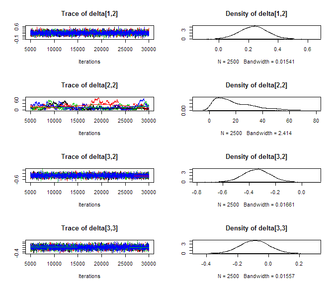
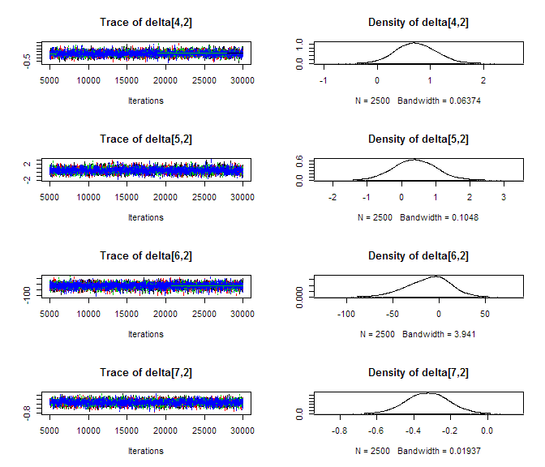
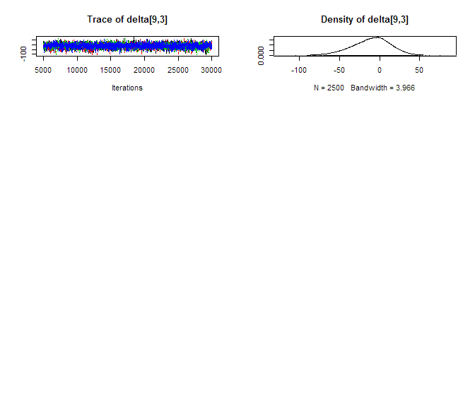

# NOAC network meta-analysis: Stroke
Benjamin Chan  
`r Sys.time()`  

[Back](README.md) to main page.

Clean up the data (do not show the code).

<!-- html table generated in R 3.2.2 by xtable 1.7-4 package -->
<!-- Thu Feb 04 14:52:33 2016 -->
<table border=1>
<tr> <th> study </th> <th> treatment </th> <th> responders </th> <th> sampleSize </th>  </tr>
  <tr> <td> RE-LY </td> <td> Dabigatran_110_mg </td> <td align="right"> 182 </td> <td align="right"> 6015 </td> </tr>
  <tr> <td> RE-LY </td> <td> Dabigatran_150_mg </td> <td align="right"> 134 </td> <td align="right"> 6076 </td> </tr>
  <tr> <td> RE-LY </td> <td> Warfarin </td> <td align="right"> 199 </td> <td align="right"> 6022 </td> </tr>
  <tr> <td> ARISTOTLE </td> <td> Apixaban_5_mg </td> <td align="right"> 212 </td> <td align="right"> 9120 </td> </tr>
  <tr> <td> ARISTOTLE </td> <td> Warfarin </td> <td align="right"> 265 </td> <td align="right"> 9081 </td> </tr>
  <tr> <td> ROCKET-AF </td> <td> Rivaroxaban_20_mg </td> <td align="right"> 188 </td> <td align="right"> 7131 </td> </tr>
  <tr> <td> ROCKET-AF </td> <td> Warfarin </td> <td align="right"> 241 </td> <td align="right"> 7133 </td> </tr>
  <tr> <td> ENGAGE AF-TIMI </td> <td> Edoxaban_30_mg </td> <td align="right"> 253 </td> <td align="right"> 7002 </td> </tr>
  <tr> <td> ENGAGE AF-TIMI </td> <td> Edoxaban_60_mg </td> <td align="right"> 182 </td> <td align="right"> 7012 </td> </tr>
  <tr> <td> ENGAGE AF-TIMI </td> <td> Warfarin </td> <td align="right"> 232 </td> <td align="right"> 7012 </td> </tr>
   </table>

Run the model using fixed-effects.


```r
M <- mtc.model(network, type="consistency", linearModel=effect)
plot(M)
```

 

```r
results <- mtc.run(M, n.adapt=nAdapt, n.iter=nIter, thin=thin)
```

# Summary

Direct and indirect odds ratios and 95% confidence bounds are stored in
[mtcStrokeOddsRatios.csv](mtcStrokeOddsRatios.csv).


```r
or <- combineResults()
write.csv(or, file="mtcStrokeOddsRatios.csv", row.names=FALSE)
print(xtable(or), type="html", include.rownames=FALSE)
```

<!-- html table generated in R 3.2.2 by xtable 1.7-4 package -->
<!-- Thu Feb 04 14:52:51 2016 -->
<table border=1>
<tr> <th> treatment </th> <th> Apixaban 5 mg </th> <th> Dabigatran 110 mg </th> <th> Dabigatran 150 mg </th> <th> Edoxaban 30 mg </th> <th> Edoxaban 60 mg </th> <th> Rivaroxaban 20 mg </th> <th> Warfarin </th>  </tr>
  <tr> <td> Apixaban 5 mg vs </td> <td>  </td> <td> 0.87 (0.66, 1.14) </td> <td> 1.20 (0.90, 1.60) </td> <td> 0.72 (0.56, 0.94) </td> <td> 1.02 (0.77, 1.32) </td> <td> 1.02 (0.78, 1.34) </td> <td> 0.79 (0.66, 0.95) </td> </tr>
  <tr> <td> Dabigatran 110 mg vs </td> <td> 1.15 (0.87, 1.52) </td> <td>  </td> <td> 1.38 (1.10, 1.73) </td> <td> 0.83 (0.63, 1.10) </td> <td> 1.17 (0.87, 1.56) </td> <td> 1.18 (0.89, 1.57) </td> <td> 0.91 (0.74, 1.12) </td> </tr>
  <tr> <td> Dabigatran 150 mg vs </td> <td> 0.83 (0.63, 1.11) </td> <td> 0.72 (0.58, 0.91) </td> <td>  </td> <td> 0.60 (0.45, 0.80) </td> <td> 0.85 (0.63, 1.14) </td> <td> 0.85 (0.64, 1.14) </td> <td> 0.66 (0.53, 0.83) </td> </tr>
  <tr> <td> Edoxaban 30 mg vs </td> <td> 1.38 (1.07, 1.80) </td> <td> 1.20 (0.91, 1.59) </td> <td> 1.66 (1.25, 2.21) </td> <td>  </td> <td> 1.41 (1.16, 1.71) </td> <td> 1.41 (1.09, 1.85) </td> <td> 1.09 (0.91, 1.31) </td> </tr>
  <tr> <td> Edoxaban 60 mg vs </td> <td> 0.98 (0.75, 1.29) </td> <td> 0.85 (0.64, 1.14) </td> <td> 1.18 (0.87, 1.59) </td> <td> 0.71 (0.59, 0.86) </td> <td>  </td> <td> 1.01 (0.76, 1.33) </td> <td> 0.78 (0.64, 0.95) </td> </tr>
  <tr> <td> Rivaroxaban 20 mg vs </td> <td> 0.98 (0.75, 1.28) </td> <td> 0.85 (0.64, 1.13) </td> <td> 1.17 (0.87, 1.57) </td> <td> 0.71 (0.54, 0.92) </td> <td> 0.99 (0.75, 1.31) </td> <td>  </td> <td> 0.77 (0.64, 0.94) </td> </tr>
  <tr> <td> Warfarin vs </td> <td> 1.26 (1.05, 1.51) </td> <td> 1.10 (0.89, 1.35) </td> <td> 1.52 (1.21, 1.90) </td> <td> 0.91 (0.76, 1.10) </td> <td> 1.28 (1.05, 1.56) </td> <td> 1.29 (1.07, 1.57) </td> <td>  </td> </tr>
   </table>

# Diagnostics


```r
summary(results)
```

```
## $measure
## [1] "Log Odds Ratio"
## 
## $summaries
## 
## Iterations = 5010:30000
## Thinning interval = 10 
## Number of chains = 4 
## Sample size per chain = 2500 
## 
## 1. Empirical mean and standard deviation for each variable,
##    plus standard error of the mean:
## 
##                                  Mean      SD  Naive SE Time-series SE
## d.Warfarin.Apixaban_5_mg     -0.23355 0.09326 0.0009326      0.0009831
## d.Warfarin.Dabigatran_110_mg -0.09181 0.10559 0.0010559      0.0011724
## d.Warfarin.Dabigatran_150_mg -0.41580 0.11390 0.0011390      0.0011390
## d.Warfarin.Edoxaban_30_mg     0.09091 0.09250 0.0009250      0.0010128
## d.Warfarin.Edoxaban_60_mg    -0.25067 0.10156 0.0010156      0.0010667
## d.Warfarin.Rivaroxaban_20_mg -0.25683 0.09825 0.0009825      0.0009991
## 
## 2. Quantiles for each variable:
## 
##                                  2.5%      25%      50%      75%    97.5%
## d.Warfarin.Apixaban_5_mg     -0.41446 -0.29699 -0.23321 -0.16940 -0.05216
## d.Warfarin.Dabigatran_110_mg -0.29887 -0.16106 -0.09101 -0.02102  0.11500
## d.Warfarin.Dabigatran_150_mg -0.63940 -0.49184 -0.41627 -0.34002 -0.19024
## d.Warfarin.Edoxaban_30_mg    -0.09194  0.02792  0.09055  0.15248  0.27166
## d.Warfarin.Edoxaban_60_mg    -0.44557 -0.31832 -0.25021 -0.18236 -0.04909
## d.Warfarin.Rivaroxaban_20_mg -0.45080 -0.32391 -0.25674 -0.18884 -0.06607
## 
## 
## $DIC
##     Dbar       pD      DIC 
## 10.00909 10.00822 20.01730 
## 
## attr(,"class")
## [1] "summary.mtc.result"
```

Sampler diagnostics.


```r
gelman.plot(results)
```

 

```r
gelman.diag(results)
```

```
## Potential scale reduction factors:
## 
##                              Point est. Upper C.I.
## d.Warfarin.Apixaban_5_mg              1          1
## d.Warfarin.Dabigatran_110_mg          1          1
## d.Warfarin.Dabigatran_150_mg          1          1
## d.Warfarin.Edoxaban_30_mg             1          1
## d.Warfarin.Edoxaban_60_mg             1          1
## d.Warfarin.Rivaroxaban_20_mg          1          1
## 
## Multivariate psrf
## 
## 1
```


```r
plot(results)
```

  


```r
autocorr.plot(results$samples)
```

    

Assess the degree of heterogeneity and inconsistency.


```r
anohe <- mtc.anohe(network, n.adapt=nAdapt, n.iter=nIter, thin=thin)
```


```r
summary(anohe)
```

```
## Analysis of heterogeneity
## =========================
## 
## Per-comparison I-squared:
## -------------------------
## 
##                  t1                t2 i2.pair i2.cons incons.p
## 1     Apixaban_5_mg          Warfarin      NA      NA       NA
## 2 Dabigatran_110_mg Dabigatran_150_mg      NA      NA       NA
## 3 Dabigatran_110_mg          Warfarin      NA      NA       NA
## 4 Dabigatran_150_mg          Warfarin      NA      NA       NA
## 5    Edoxaban_30_mg    Edoxaban_60_mg      NA      NA       NA
## 6    Edoxaban_30_mg          Warfarin      NA      NA       NA
## 7    Edoxaban_60_mg          Warfarin      NA      NA       NA
## 8 Rivaroxaban_20_mg          Warfarin      NA      NA       NA
## 
## Global I-squared:
## -------------------------
## 
##   i2.pair i2.cons
## 1       0       0
```

```r
plot(anohe)
```

```
## Analysis of heterogeneity -- convergence plots
## Unrelated Study Effects (USE) model:
```

  

```
## Unrelated Mean Effects (UME) model:
```

   

```
## Consistency model:
```

  
